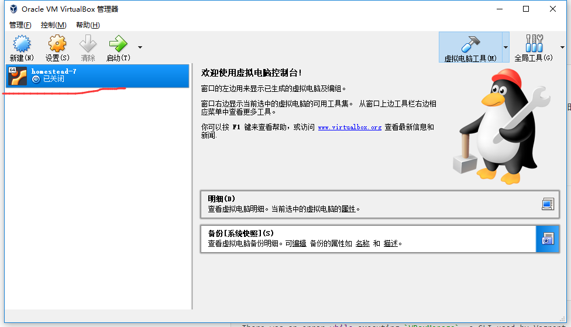

# 一、文档中的

## 1. 资源路由

| 动作      | URI                    | 行为    | 路由名称       |
| --------- | ---------------------- | ------- | -------------- |
| GET       | `/photos`              | index   | photos.index   |
| GET       | `/photos/create`       | create  | photos.create  |
| POST      | `/photos`              | store   | photos.store   |
| GET       | `/photos/{photo}`      | show    | photos.show    |
| GET       | `/photos/{photo}/edit` | edit    | photos.edit    |
| PUT/PATCH | `/photos/{photo}`      | update  | photos.update  |
| DELETE    | `/photos/{photo}`      | destroy | photos.destroy |

关于资源路由，文档中有的是上面这个表，比较疑惑的一点是：这里面既有一个 `create`  方法，又有一个 `store` 方法。怎么理解呢？

> store 是保存，而 create 是创建一个表单页（即通过访问这条路由跳到编辑表单页面）。
>
> create 和 show 冲突？这里没搞懂


## 2. 表单验证

### 一些规则

#### unique:*table*,*column*,*except*,*idColumn*

第一二字段好说，文档解释的很详细了。但是对于第三四个字段已经没有显示的第五六个字段有必要解释一下：

```php
// 进行唯一性校验的时候忽略 ID 为 10 的一行，常在更新时使用，具体见文档
'email' => 'unique:users,email_address,10'
    
// 如果你的主键不是默认的 id，而是自己指定的 myId
'email' => 'unique:users,email_address,10,myId'
    
// 添加 where 语句，唯一性校验的时候只在 account_id=1 的行中进行匹配
'email' => 'unique:users,email_address,NULL,id,account_id,1    
```

#### min:value

还有这种的，文档上是说以 `size`  方法获取的为准，但是经过测试，为 `integer` 时，value 表示的并不是字符长度，而是数值大小。`min:1` 就表示要大于等于 1。


## 3. 文件存储

### 3.1 一些坑

#### 运行 php artisan storage:link 报错

解决办法：用管理员身份运行 `vagrant up` 和 `vagrant ssh`

#### 管理员运行又报错

```shell
# 报错内容
There was an error while executing `VBoxManage`, a CLI used by Vagrant
for controlling VirtualBox. The command and stderr is shown below.
```

解决办法：打开软件把虚拟机完整关闭




### 3.2 存储方式整理

#### 单个文件存储

```php
public function store(Request $request)
{
    $file = $request->file('img');
    $dir = $request->dir;

    # 方法 1
    $path = Storage::disk('public')->put($dir, $file);
    $url = Storage::disk('public')->url($path);
    
    # 方法 2：流式传输，适合大文件
    $path = Storage::disk('public')->putFile($dir, $file);
    $url = Storage::disk('public')->url($path);
	
    # 方法 3
    // 这里不能选 disk，就会存在和 public 同级的目录，如果文件不是用来对外展示就没问题
    $path = $file->store($dir);
    $url = Storage::disk('public')->url($path);

    dd($url);
}
```

#### 一次存储多个文件

```php
public function store(Request $request)
{
    $files = $request->file();
    $dir = $request->dir;
    $urls = array();

    foreach ($files as $file) {
        $path = Storage::disk('public')->put($dir, $file);
        $urls[] = Storage::disk('public')->url($path);
    }

    return $urls;
}
```


## 4. Redis

### 几句话理解Redis

- 存储在内存中，key-value 关系而非关系数据库那么复杂的关系
- 一个实例默认有 16 个数据库，数据库中间互相隔离，flushdb 清空当前数据库，flushall 删除所有数据库
- 新建实例就是开一个新端口，独开一个 Redis
- 持久化有两种方式，一个是存储命令，一个是存储数据

### Redis 可视化的一个插件

用 Laravel 实现的 [一个 Redis 数据可视化插件](https://laravel-china.org/topics/7139/open-source-a-redis-web-management-tool)。


## 5. Model

在 save 获取 primary id

```php
$user= new User(['name' => 'Jhon', 'age' => 3]);
$user->save();
$id = $user->id;
```


# 二、测试中

## Postman

### 模拟 AJAX 请求

添加一个header头：

```
X-Requested-With:XMLHttpRequest
```

