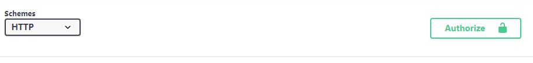
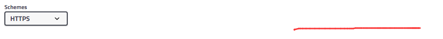

想用 Swagger 来生成工作室 API 的文档，但是其组件和丰富性超乎了我的想象，特地记录一下。


# 一、Swagger-UI

从 GitHub 下载最新版，复制其中 dist 文件夹中的所有内容，修改其中 index.html 文件：

```html
<script>
window.onload = function() {
  // Build a system
  const ui = SwaggerUIBundle({
    url: " 改为你的 yml 或 json 文件的地址",
    dom_id: '#swagger-ui',
    deepLinking: true,
    presets: [
      SwaggerUIBundle.presets.apis,
      SwaggerUIStandalonePreset
    ],
    plugins: [
      SwaggerUIBundle.plugins.DownloadUrl
    ],
    layout: "StandaloneLayout"
  })

  window.ui = ui
}
</script>
```

然后挂在服务器上，访问即可看到 Swagger-UI 了，这里有值得注意的两点：

- 更新你的就 json 文件有时候并不会刷新 Swagger-UI 的内容，我是改了文件名才成功刷新的
- Swagger-UI 支持 `Try it out`， 这要求跨域，所以你最好把它部署到和你 api 同域名，否则会 `Fail to Fetch`


## Swagger-PHP

一说到 PHP 用 Swagger ，网上都是 Swagger-PHP 这个插件，我刚开始写文档时也尝试了这个插件，但是三个小时后，恕我直言，这个插件纯粹多此一举，用这个插件去写 Swagger 文档绝对是最蠢的事。随便就可以列举几点不应该去用的理由：

- 文档缺少
- 语法糟糕，写起来竟然还不如直接写 json 或 YAML 快，既然如此我为什么要这么绕远路
- 冗长的注释写在代码中显得是在注释中插代码
- 把代码和文档同步在一个文档这个唯一优点显得并不那么明显


## Swagger Editor


## SwaggerHub

https://app.swaggerhub.com


## OAS3

### requestBody

https://swagger.io/docs/specification/describing-request-body/


### $ref: '#/components/requestBodies/Pet'

用以实现复用和引用


## Authrorize

    bearerAuth:
      type: http
      scheme: bearer
      bearerFormat: JWT
security 中需要的对应 header 并不需要再写在 parameters 中


### Authorize 不显示






| 类型 | 获取 | 作用 |
| :--: | :--: | :--: |
|      |      |      |
|      |      |      |
|      |      |      |

