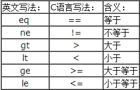

对于一个Web开发者来说，抓包无疑是一项必须掌握的技能。而抓包工具又很多，最常用的就是三种：浏览器的开发者工具（一般只能查看包信息）、Fiddler、WireShark。下面会对这三种抓包工具进行介绍，并比较他们的不同和优势。

> 抓包（packet capture）就是将网络传输发送与接收的数据包进行截获、重发、编辑、转存等操作，也用来检查网络安全。抓包也经常被用来进行数据截取等。

# 一、WireShark

[WireShark](https://www.wireshark.org/) 是一款免费的开源软件，支持 Windows/Unix/Mac 多平台，是目前全世界最广泛的网络数据包分析软件之一。另外，TShark 是 WireShark 的 CLI 版本。


## 1. 下载和安装

前往官网下载即可，但是安装的时候会询问你是否安装 WinPcap 和 USBPcap。

**WinPcap**：

​	Windows 平台的 WireShark 依赖 winpcap库，而 Unix 平台依赖 libpcap 库，需要使用这个库的功能进行封包捕捉工作，所以这是必须，务必安装。

**USBPcap**：

​	USBPcap（USB Packet Capture）是一个轻量级的应用程序，能够提供对USB数据包的捕获功能。根据你的需要安装。


## 2. WireShark VS Fiddler

**功能上**：

​	WireShark 不支持修改包中的内容，如果要修改包中内容，请用 Fiddler。

**技术实现上**：

​	WireShark 是通过监听网卡来实现的抓包，而 Fiddler 是通过代理 Web 服务器的形式工作的，它使用代理地址:127.0.0.1，端口:8888。


既然这样，看上去 Fiddler 的功能比 WireShark 要多，那为什么还要用 WireShark 呢？因为 Fiddler 只能够监听到应用层，即 HTTP 和 HTTPS 协议，但是 WireShark 却能够监听 TCP/IP 的数据，比应用层更底层，所以 WireShark 能够抓到比 Fiddler 更多的数据。


## 3. WireShark的使用 

### 3.1 打开 WireShark 选择接口

有时候你可能找不到你的网卡接口，此时管理员打开CMD输入以下命令，然后刷新接口列表即可。

```shell
net start npf
```

进入你的网卡接口（一般叫做“以太网”）


### 3.2 设置过滤器 

过滤分为两种：

- 显示过滤器：用于在已经捕获到的结果中查找，可以在得到捕获结果后任意修改
- 捕获过滤器：用于决定捕获什么数据，需要在开始捕获之前就设置好

#### a) 捕获过滤器

选择 捕获 -> 捕获过滤器，可以看到已经存在一些过滤器：


接着，你可以选择新建一个过滤器，在此敲过滤规则会有语法提示，不过我还是列举语法如下：

**过滤表达式的语法(语法正确：浅绿色  语法错误：粉红色)**

[](http://s3.51cto.com/wyfs02/M02/45/E0/wKioL1PsyB3xMIfeAACEUpEpGoE889.jpg)

**Protocol（协议）**:
可能的值: ether, fddi, ip, arp, rarp, decnet, lat, sca, moprc, mopdl, tcp and udp.
如果没有特别指明是什么协议，则默认使用所有支持的协议。 

**Direction（方向）**:
可能的值: src, dst, src and dst, src or dst
如果没有特别指明来源或目的地，则默认使用 "src or dst" 作为关键字。
例如，"host 10.2.2.2"与"src or dst host 10.2.2.2"是一样的。

**Host(s)**:
可能的值： net, port, host, portrange.
如果没有指定此值，则默认使用"host"关键字。
例如，"src 10.1.1.1"与"src host 10.1.1.1"相同。 

**Logical Operations（逻辑运算）**:

可能的值：not(!), and(&&), or(||).
否("not")具有最高的优先级。或("or")和与("and")具有相同的优先级，运算时从左至右进行。
例如，
"not tcp port 3128 and tcp port 23"与"(not tcp port 3128) and tcp port 23"相同。
"not tcp port 3128 and tcp port 23"与"not (tcp port 3128 and tcp port 23)"不同。

**例子：**

```
// 显示目的TCP端口为3128的包
tcp dst port 3128
 
// 显示来源IP地址为10.1.1.1的封包
ip src host 10.1.1.1
 
// 显示来源为UDP或TCP， 并且端口号在2000-2500范围内的封包
src protrange 2000-2500
 
// 显示除了icmp以外的所有封包，icmp通常被ping工具使用
not icmp    或者  ! icmp
 
// 显示来源IP地址为10.7.2.12，但目的地址不是10.200.0.0/16的封包
src host 10.7.2.12 and (not dst net 10.200.0.0/16)

```

**注意事项：**
当使用关键字作为值时，需使用反斜杠“\”。
"ether proto \ip" (与关键字"ip"相同).
这样写将会以IP协议作为目标。

"ip proto \icmp" (与关键字"icmp"相同).
这样写将会以ping工具常用的icmp作为目标。 

可以在"ip"或"ether"后面使用"multicast"及"broadcast"关键字。
当您想排除广播请求时，"no broadcast"就会非常有用。 

**使用捕获过滤器**：

​	点击停止，再点击选项，然后即可选择对应的捕获过滤器，最后点击开始即可。


#### b) 显示过滤器

显示过滤器就是主界面上那个很长的输入框，左边的书签图标中是预设的一些过滤器，右边的“表达式...”可以用来构建新的过滤器，可以直接通过鼠标点击来完成一条过滤器规则的构建，也可以直接手动输入，列举语法如下：


**Protocol（协议）**：您可以使用大量位于OSI模型第2至7层的协议，比如：IP，TCP，DNS，SSH。

**String1, String2** (可选项)：协议的子类，点击相关父类旁的"+"号，然后选择其子类。 

**Comparison operators （比较运算符）**: 可以使用6种比较运算符。



**Logical expressions（逻辑运算符）**


**例子：**

```
// 显示SNMP或DNS或ICMP封包
snmp || dns || icmp
 
// 显示来源或目的的IP地址为10.1.1.1的封包
ip.addr == 10.1.1.1
 
// 显示来源不为10.1.12.3或者目的不为10.4.5.6的封包。
ip.src != 10.1.2.3 or ip.dst != 10.4.5.6 
 
// 显示来源或目的TCP端口为25的封包
tcp.port == 25
 
// 显示目的TCP端口为25的封包
tcp.dstport == 25
 
// 显示包含TCP SYN标志的封包
tcp.flags.syn == 0x02
```

输入完成后，点击 Apply 即可生效。


### 3.3 分析数据包

任意选择一个数据包，中间一块是封包的详细信息：


各行的信息为:

**Frame: **  物理层的数据帧概况

**Ethernet II: **数据链路层以太网帧头部信息

**Internet Protocol Version 4: **互联网层IP包头部信息

**Transmission Control Protocol:  **传输层T的数据段头部信息，此处是TCP

**Hypertext Transfer Protocol:  **应用层的信息，此处是HTTP协议

此外，WireShark详细信息的层与对应OSI七层模型：


### 3.4 WireShark ＆ HTTPS


# 二、Ethereal 

