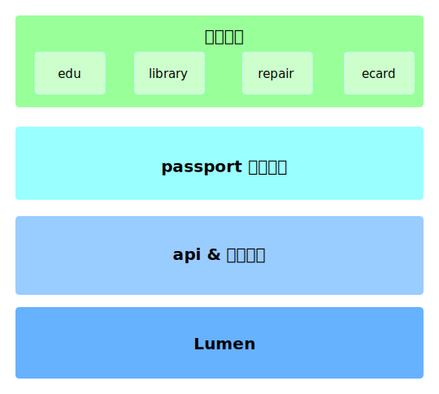

关于三翼工作室RESTful API 的架构设计。


# 一、需求

工作室的 API 为工作室的所有产品提供服务，数据来源来于学校各个系统，另外开放给全校开发者使用，所以要求如下：

- **低耦合、层次化的设计：**由于学校未来可能会有新的系统，所以各个系统之间的必须相互独立，并且新系统的加入不会导致底层结构的修改；
- **RESTful 风格：**使用 RESTful 的风格并不是因为它有多合适，而是能够让 API 路由设计时有可以相对可以参考的方案，不至于时间久了而紊乱，所以要根据 RESTful 风格设计自己的一版设计规范；
- **精确的权限控制：**因为 API 的使用者广泛，所以需要根据场景设置精确的权限控制；


# 二、架构设计

## 1. 架构设计图



**Lumen：**底层框架

**api & 权限控制：**api 的注册管理、token管理、权限的控制

**passport 统一登录：**模拟登录

**各级系统：**数据的爬取


## 2. 请求流程图 

.svg)


# 三、具体设计


### RESTful 数据请求规范

- 用于认证的 token 统一放在 header头
- GET、DELETE 请求不带 body
- POST、PATCH、PUT、DELETE 统一将数据放于 body 中，以 application/json 方式
- 获取 token 理解为在服务端新建一个 token，所以用 post 方式


### 时区设置

.env

```
APP_TIMEZONE=PRC
DB_TIMEZONE=+08:00
```


### postman 全局变量和局部变量

https://www.jianshu.com/p/f703b0ace7f9

https://www.jianshu.com/p/391e995881c0


### migrate 生成数据表

```shell
php artisan migrate
```


### seed 填充测试数据

初始、测试、标准测试

```shell
php artisan db:seed  # 初始化
php artisan db:seed --class=UsersTableSeeder # 填充测试用户数据（一次一条，随机）
php artisan db:seed --class=UsersStableTableSeeder  # 生成固定测试用户数据（postman中的缺省值）
```