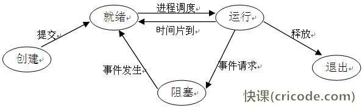

本文是对 [Interview-Notebook项目](https://github.com/CyC2018/Interview-Notebook/blob/master/notes/%E8%AE%A1%E7%AE%97%E6%9C%BA%E6%93%8D%E4%BD%9C%E7%B3%BB%E7%BB%9F.md#%E7%BB%8F%E5%85%B8%E5%90%8C%E6%AD%A5%E9%97%AE%E9%A2%98)的一些补充。


# 一、概述

## 1. 中断

### 中断嵌套

操作系统在中断时运行响应新的中断，此时就会出现中断嵌套的情况。


### 中断优先级

为了防止低紧急程度的任务打断高紧急程度的任务，同时高紧急程度的任务能够优先处理，出现的中断优先级的概念，优先级顺序如下：
$$
硬件故障中断 > 自愿中断 > 程序性中断 > 外部中断 > I/O中断
$$
**自愿中断：** 正在运行的程序所期待的事件引起的中断

**程序性中断：** 程序发生了错误引起的中断，比如：溢出、越界、非法操作等

**外部中断：** CPU 指令以外的事件引起的中断


# 二、进程管理

**强调：**

- 进程是资源分配的基本单位
- 线程是独立调度的基本单位
- 一个线程可以有多个进程，他们共享进程资源（内存资源等）

### 1. 五状态模型




### 2. 同步—信号量机制

**基本原理：** 两个或多个进程通过简单的信号进行合作，一个进程可以被迫在某一位置停止，直到接收到一个特定的信号为止。

**信号量：** 是一个整型变量，可以对其执行 down 和 up 操作，也就是常见的 **P（测试）**和 **V（增加）** 操作。

**概述：**如果一个操作是需要互斥的，那么就把他包在 up 和 down 操作之间，可以被多个进程的访问的资源是临界区资源，就需要上锁。把 **up/wait 理解为测试**，把 **down/signal 理解为测试后的操作**

**理解：**凡在进行一个互斥操作前一定先进行一次 wait 测试，然后再进行操作，然后再释放。由于 wait 中会让你在不满足条件时进行等待，所以不用担心会出现问题。

#### 整型信号量

```c
void wait(s){
    while(s <= 0){
        ; // do nothing
        s--;
    }
}
void signal(){
    s++;
}
```

S 表示资源数目的整型变量（临界区数目），没有满足让权等待的原则，可能会使进程处于饥饿的忙等状态。

#### 记录型信号量

```c
typedef struct{
    int value;			// 非负初值的整型变量
    QueueType queue;     // 初始状态为空的进程队列，一个进程需要等待该信号量时，就加入队列
}se;
void wait(se *s){					// 表示请求一个资源，资源数减一
    s.value--;
    if(s.value < 0) block(s.queue);		// 信号量小于 0 时，把进程加入队列，等待信号量
}
void signal(se *s){					// 表示释放一个资源，资源数加一
    s.value++;
    if(s.value <= 0) wakeup(s.queue);	// 把一个进程从等待队列移出
}
```

- s.value 为正时，表示某类资源的可用个数
- s.value 为负时，表示阻塞队列中的等待进程个数

#### 二元信号量

```c
typedef struct{
    enum {zero, one} value;
    QueueType queue;
}binarySe;
void wait(binarySe *s){
    if(s.value == one) s.value = zero;
    else block(s.queue);
}
void signal(binartSe *s{
    if(s.queue is empty()) s.value = one;
    else wakeup(s.queue);
}
```

- wait() 检查信号量的值，若为 1，则该改为 0，并继续执行进程；若为 0，则把要执行的进程加入等待队列
- signal() 检查是否有进程在等待队列进行等待，如果没有就把信号量改为 1，如果有正在等待的进程，就唤醒其中一个受阻的进程


### 3. 同步—管程

将临界区集中管理，将共享资源用数据结构抽象表示。用一个专门的进程来控制每次仅有一个进程能够访问临界资源。

### 4. 经典同步问题

#### 生产者-消费者问题

- 信号量机制实现
- 管程实现

#### 读者-写者问题

- 信号量机制实现

#### 哲学家就餐问题

信号量机制实现，书上的例子比文档中的更简单易懂。

```c
// 初步实现，不完美，会出现死锁
sem chopstick[5] = {1,1,1,1,1};  // 这五个信号量代表五根筷子的状态
int i；	// 筷子编号
    void philosopher(int i) {
    while(TRUE){
        // think
        wait(chopstick[i]); // 左边的筷子
        wait(chopstick[(i+1)%5]); // 右边的筷子
        // eat
        signal(chopstick[(i+1)%5]);
        signal(chopstick[i]); 
    }
}

// 增加一个条件：只有在左右两根筷子都能拿时才允许进餐

// 或增加一个条件：最短允许四个哲学家同时进餐
sem chopstick[5] = {1,1,1,1,1};
sem room = {4};
int i；
    void philosopher(int i) {
    while(TRUE){
        // think
        wait(room);			// 检查当前进餐的哲学家数目
        wait(chopstick[i]);
        wait(chopstick[(i+1)%5]);
        // eat
        signal(chopstick[(i+1)%5]);
        signal(chopstick[i]); 
        signal(room);
    }
}

void main(){
    parbegain(philosopher(1),philosopher(2),philosopher(3),philosopher(4),philosopher(5));
}
```


### 3. 进程通信方式

1. 管道
2. 消息队列
3. 套接字
4. 共享内存（最快的方式）


# 三、死锁

## 1. 死锁的必要条件

- 互斥
- 占有和等待
- 不可抢占
- 环路等待

## 2. 死锁检测与恢复

- 鸵鸟策略
- 死锁检测：画资源分配图，进行深度优先搜索，对访问过的节点标记，如果又已经标记的节点，表示存在环
- 死锁恢复：抢占、回滚、杀死进程

## 3. 死锁预防

在程序运行 **之前** 预防发生死锁。

- 破坏互斥条件
- 破坏占有和等待条件
- 破坏不可抢占条件
- 破坏环路等待

## 4. 死锁避免

在程序运行时避免发生死锁。

- 安全状态
- 银行家算法（单个资源和多个资源）


# 四、内存管理

**分页：**物理，透明，一维地址空间，大小不可变，用来实现虚拟内存，从而获得更大的地址空间

**分段：**逻辑，需要程序员自己划分，二维的，大小可变，使程序和数据可以被划分为逻辑上独立的地址空间并且有助于共享和保护

**段页式：**

## 1. 虚拟存储

### 页面置换算法

### 最大虚拟存储

与计算机地址寄存器的位数有关，如果是24位，就是 2^24^B


# 五、设备管理

## 1. 磁盘调度算法

## 2. I/O 系统控制方式

- 程序直接控制
- 中断控制方式
- DMA控制方式
- 通道控制方式


# 六、文件系统


# 七、系统安全


