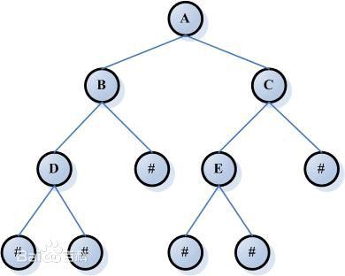

在此整理汇总了数据结构的各种基础知识。

# 一、基本概念

## 1. 数据结构

数据结构是计算机存储、组织数据的方式。数据结构是指相互之间存在一种或多种特定关系的数据元素的集合。通常情况下，精心选择的数据结构可以带来更高的运行或者存储效率。数据结构往往同高效的检索算法和索引技术有关。

## 2. 复杂度

### 2.1 时间复杂度

$$
T(n) = O( f(n) )
$$

按复杂度从小到大：

- O(1)
- O(logn) —— 底数默认为2
- O(n)
- O(n^c^)
- O(c^n^)
- O(n!)

### 2.2 空间复杂度

$$
S(n) = O( f(n) )
$$

# 二、基本数据结构

## 1. 线性表

最常用最简单的一种数据结构，长度可以根据需要增长或者缩短，元素可以插入和删除。

### 1.1 顺序存储结构

- 代表：**C语言中的数组**
- 特点：是以元素在计算机内物理位置相邻来表示线性表中数据元素之间的逻辑关系。
- 优点
  - 节省存储空间
  - 可随机存取元素
- 缺点
  - 插入和删除需要移动元素
- 时间复杂度：插入和删除元素的时间复杂度为$O(n)$

### 1.2 链式存储结构

- 代表：**计算机中的文件存储**
- 特点：由多个节点组成，每个节点由数据域和指针域组成。很多情况下是线性表的首选存储结构。
- 优点
  - 物理存储结构上不必相邻，可充分利用碎片空间
  - 插入和删除灵活
- 缺点
  - 没有了顺序存储结构可随机存取的优点
- 时间复杂度：查找、插入和删除的时间复杂度均为$O(n)$

#### 线性链表

又称单链表。整个链表的存取必须从**头指针**开始，头指针指向链表中第一个节点。最后一个节点的指针为空**NULL**。

#### 循环链表

表中最后一个结点的指针域指向头结点，整个链表形成一个环，从表中任一结点出发均可找到表中其他结点。

- 时间复杂度：合并两个线性表的时间复杂度仅为$O(1)$

#### 双向链表

单链表查找下一个元素的时间复杂度仅为$O(1)$，但是查找前一个元素的时间复杂度为$O(n)$，因此出现了双向链表。其结点有两个指针域，一个指向后继，一个指向前驱。

## 2. 栈和队列

从数据结构角度看，栈和队列也是线性表，特殊性在于栈和队列的基本操作是线性表操作的子集，它们是操作受限的线性表，可称为限定性的数据结构。

### 2.1 栈

限定仅在表尾进行插入或删除操作的详细表。表尾称为**栈顶**，表头称为**栈底**，不含元素的为**空栈**，**后进后出**。

#### 顺序栈

利用一组地址连续的存储单元依次存放自栈底到栈顶的数据元素。同时用一个**指针top**指示栈顶元素在顺序栈中的位置。**指针base**指向栈底位置，base为NULL时，表明栈结构不存在，top=base表示为空栈。

#### 链式栈

链式存储的栈。

### 2.2 队列

与栈相反，一种**先进先出**的线性表。允许插入的一端叫做**队尾**，允许删除的一端称为**队头**。

**双端队列：**如一个端点允许插入和删除，一个端点只允许删除。

#### 链队列 —— 一个队列的链式表示

链式存储结构的实现。同样需要一个头指针为尾指针指向头结点和尾结点。

#### 循环队列 —— 一个队列的顺序表示

除了用一组地址连续的物理存储单元存储元素外，还需要一个**front指针**指向列头元素，一个**rear指针**指向列尾元素。**front=rear**表示空队列，插入新的队尾元素时，rear增1，删除队头元素时，front增1。

> 但是这样存在一个问题，即当front和rear一直都增1，到达预定容量的最后面，此时需要再添加元素的话无法往下走了，但是前面却还剩余新清出的空间，造成了空间的浪费。

解决办法是将顺序队列臆造为一个环状空间，但是又催生了一个问题：

> 队列满和队列空都是front=rear，无法加以区分。

解决办法有两种：

- 另设一个变量记录队列中元素的个数
- 少用一个元素，约定“队列头指针在队列尾指针的下一位置上”作为队列“满”的状态标识

## 3. 串

即字符串，串中任意个连续的字符组成的子序列称为该串的**子串**，子串在主串的位置则以子串的第一个字符在主串中的位置来表示。

### 3.1 定长顺序存储表示

- 特点：用一组连续的存储单元存储串值。需要预先定义串的长度，超过预定义长度的则会被“截断”。
- 缺点：超过部分就会被截断。

### 3.2 堆分配存储表示

- 特点：仍然以一组地址连续的存储单元存放串值字符序列，但是其存储空间是在程序执行过程中动态分配而得的。对串长没有任何限制，更显灵活。

### 3.3 块链存储表示

- 特点：链式存储结构。并且除头指针外还可附设一个尾指针指示链表中的最后一个结点，并给出当前串的长度。此时存在一个结点大小的问题，即每个结点可以存放一个字符，也可以存放多个字符。如果最后一个节点并没有被填满，那么就用“#”占满。

- 串值密度，直接影响着串处理的效率：
  $$
  存储密度=\frac{串值所占的存储位}{实际分配的存储位}
  $$

###3.4 串的模式匹配算法

#### 模式匹配

最坏情况下的时间复杂度为$O(n\ast m)$

#### 模式匹配的改进 —— KMP算法

时间复杂度为 $O(n+m)$，最大特点是指示主串的指针不需要回溯，整个匹配过程中，对主串仅需从头至尾扫描一遍。

#### 一点注意

虽然模式匹配算法的复杂度为$O(n\ast m)$，但是在一般情况下，其实际执行时间近似于$O(n+m)$，因此至今任被采用。KMP算法仅当模式与主串之间存在许多“部分匹配”的情况下才显得比模式匹配算法快得多。

## 4. 数组和广义表

### 4.1 数组

数组一旦被定义，它的维数和维界就不会再改变。因此，除了结构的初始化和销毁之外，数组只有存取元素和修改元素值的操作。由于数组一般不作插入或删除操作，所以采用顺序存储结构表示是自然的事了。

#### 二维数组

二维数组是以数组为元素的数组，所以二维数组有两种存储方式：

- 以列序为主序的存储方式
- 以行序为主序的存储方式

**随机存储结构：**计算各个元素存储位置的时间相等，存取数组中任一元素的时间也相等。

### 4.2 广义表

广义表示线性表的推广，广泛用于人工智能等领域的表处理语言LISP语言，把广义表作为基本的数据结构，连程序也定义为一系列的广义表。广义表一般记作：
$$
LS = (a_1,a_2,a_3,\cdots,a_n)
$$
在广义表的定义中，$a_i$ 可以是单个元素，也可以是广义表，分别称为广义表 $LS$ 的**原子**和**组表**。习惯上，用大写子母表示广义表，用小写子母表示原子。广义表非空时，称第一个元素 $a_1$ 为 $LS$ 的**表头**，称其余元素组成的表 $(a_2,a_3,\cdots ,a_n)$ 为**表尾**。广义表可以是一个递归的表。

#### 广义表的存储结构

由于广义表的性质，广义表难以用顺序存储结构表示，通常采用链式存储结构。再由于广义表中数据元素可能为原子或列表，所以需要两种结构的结点。一种是表结点，一种是原子结点。

##### 表结点和原子结点

一个表结点由三个域组成：标志域、指示表头的指针域、指示表尾的指针域。

一个原子结点由两个域组成：标志域、值域。

> 此外还有另一种结点结构

一个表结点由三个域组成：标识域、表结点的表头指针、指向下一结点的指针

一个原子结点由三个域组成：标识域、值域、指向下一结点的指针

## 5. 树和二叉树

### 5.1 树

树型结构是一类重要的**非线性数据结构**，直观来看，树是以分支关系定义的层次结构。

- 树的基本定义：树是 $n(n\ge 0)$ 个结点的有限集。在任意一棵非空树中：

  - 有且仅有一个特定的称为根的结点
  - 当$n>1$ 时，其余结点可分为$m(m>0)$个互不相交的有限集，其中每一个集合本身又是一棵树，并且称为根的**子树**

- 树的基本术语：

  - **结点的度：**结点拥有的子树数
  - **叶子 / 终端结点：**度为0的结点
  - **分支结点 / 非终端结点：**度不为0的结点，除了根节点之外，也称**内部结点**
  - **树的度：**树内各结点的度的最大值
  - **结点的孩子：**结点的子树的根节点，该结点称为孩子的**双亲**
  - **兄弟：**同双亲的两个结点
  - **结点的祖先：**从根到该结点所经分支上的所有结点，**子孙**的定义相反
  - **堂兄弟：**双亲在同一层的结点

  - **结点的层次：**从根开始定义，根为第一层，根的孩子为第二层
  - **深度：**树中结点的最大层次
  - **有序树 / 无序树：**将树中结点的各子树看成从左至右是有次序的（即不能互换），则称为有序树，否则为无序树
  - **森林：**$m(m\ge 0)$ 棵互不相交的树的集合。对数中的每个结点而言，其子树的集合即为森林。由此，也可以森林和树相互递归的定义来描述树。

  就逻辑结构而言，任何一棵树是一个二元组$Tree=(root,F)$，其中：root是数据元素，称为树的根结点，F是$m(m\ge 0)$棵树的森林，$F=(T_1,T_2,T_3,\cdots ,T_m)$。其中$T_i=(r_i,F_i)$称根root的第 $i$ 棵子树。

#### 树的存储结构

##### 双亲表示法

利用结点只有唯一双亲的特性，查找一个元素的父节点的时间复杂度为$O(1)$，而查找结点的孩子需要遍历整个结构，时间复杂度为$O(n)$。

##### 孩子表示法

即把每个结点用单链表的形式组合在一起，然后每个结点的一个指针域指向第一个孩子，第一个孩子指向第二个孩子。如果带上双亲域，则在单链表结点中再用一个指针域指向双亲结点。

树的孩子链表存储表示中可以很方便地查找到每个结点的子结点以及兄弟结点，带上双亲域(第二竖排)后，还可以很方便地找出其双亲结点，比树的双亲表示法更胜一筹。

##### 孩子兄弟表示法

又称二叉树表示法，或二叉链表示法。即一个结点三个域：数值域、第一个孩子域、下一个兄弟域，具体如图：

### 5.2 二叉树

二叉树是另一种树型结构，它的特点是每个结点至多只有两棵子树，并且二叉树有左右之分，顺序不能颠倒。

二叉树或为空，或是由一个根结点加上两棵分别称为左子树和右子树的、互不相交的二叉树组成。由于这两棵子树也是二叉树，根据二叉树的定义，它们也可以是空树。由此，二叉树可以有5中基本形态。

#### 二叉树的性质

- 在二叉树的第 i 层上至多有 $2^{i-1}$ 个结点 $(i\ge 1)$
- 深度为 k 的二叉树至多有 $2^k-1$ 个结点$(k\ge 1)$
- 对任何一棵二叉树$T$，如果其终端结点数为$n_0$，度为2的结点数为$n_2$，则$n_0=n_2+1$

##### 完全二叉树和满二叉树

这两种二叉树是两种特殊形态的二叉树。

**满二叉树：**一棵深度为k且有2^k^-1个结点的二叉树称为满二叉树，这种树的特点是每一层上的结点数都是最大结点数。

**完全二叉树：**深度为 k 的，有 n 个结点的二叉树，当且仅当其每一个结点都与深度为 k 的满二叉树中编号从 1 至 n 的结点一一对应时，称之为完全二叉树。完全二叉树的特点：

* 叶子结点只可能在层次最大的两层上出现
* 对任一结点，若其右分支下的子孙的最大层次为 l ，则其左分支下的子孙的最大层次必为 l 或 l+1

#### 二叉树的存储结构

##### 顺序存储结构

用一组连续的地址的存储单元依次自上而下、自左至右存储完全二叉树上的结点元素，即将**完全二叉树**上编号为 $i$ 的结点元素存储在加上定义的一维数组中下标为 $i-1$ 的分量中。对于不完全的二叉树，则对应着完全二叉树将元素存储在对应分量中，不存在的叶子则置为 “0” ，表示不存在此结点。

所以在最坏的情况下，一个深度为 k ，但是只有 k 个结点的单支树，需要 2^k^-1 个存储单元。

##### 链式存储结构

如图，链式存储结构中结点可以设计为三个域或者四个域：

- 第一种，二叉链表：数据域、左指针域、右指针域
- 第二种，三叉链表：数据域、左指针域、右指针域、双亲结点指针域

容易得证：在含有 n 个结点的二叉链表中有 n+1 个空链域。

#### 遍历二叉树和线索二叉树

##### 遍历二叉树

遍历二叉树：按某条搜索路径巡访书中的每个结点，使得每个结点均被访问一次，而且仅被访问一次。

按照递归定义的三种长用遍历顺序如下：

**先（根）序遍历：**若二叉树为空，则空操作，否则：

- 访问根结点
- 先序遍历左子树
- 先序遍历右子树

**中（根）序遍历：**若二叉树而空，则空操作，否则：

- 中序遍历左子树
- 访问根结点
- 中序遍历右子树

**后（根）序遍历：**

- 后序遍历左子树
- 后序遍历右子树
- 访问根结点

不论按哪一种遍历次序，对 $n$ 个结点的时间复杂度均为 $O(n)$。

##### 线索二叉树

遍历二叉树是对一个非线性结构进行线性化操作，使每个结点在线性序列中都有唯一的前驱和后继。如何保存这些信息呢？在前面知道在含有 n 个结点的二叉链表中有 n+1 个空链域，所以我们其实可以用这空链域来保存这些信息。

- 每一个结点为 5 个域：左域，左标记域、数据域、右标记域、右域

左右标记域标记有没有左右子树，如果有，则左右域指向左右子树。如果没有，则左域指向前驱，右域指向后继。

以这种结构存储而成的二叉树称为**线索二叉树**，对二叉树以某种次序遍历使其变为线索二叉树的过程称为**线索化**。

#### 最优二叉树（赫夫曼树）

给定n个权值作为n个叶子结点，构造一棵二叉树，若带权路径长度达到最小，称这样的二叉树为最优二叉树，也称为哈夫曼树(Huffman Tree)。哈夫曼树是带权路径长度最短的树，权值较大的结点离根较近。

## 6. 图

图是一种更为复杂的数据结构，其结点之间的关系可以任意相连。

### 6.1 基本概念

- 顶点：图中的数据元素
- 集合 $V$：顶点的有穷非空集合
- 集合 $VR$：两个顶点之间的关系
- 有向图：若$<v,w> \in VR$，则$<v,w>$表示从 $v$ 到 $w$ 的一条弧，且称 $v$ 为**弧头**，$w$ 为**弧尾**。
- 无向图：若$<v,w>\in VR$ 必有 $<w,v>\in VR$ , 即VR是对称的，则以无序对 $(v,w)$ 代替这两个有序对，表示 $v$ 和 $w$ 之间的一条**边**，此时的图称为**无向图**
- 完全图：
  - 对于无向图，其边数的取值范围为 $0$ 到 $\frac{1}{2}n(n-1)$，有$\frac{1}{2}n(n-1)$条边的称为**完全图**
  - 对于有向图，其边数的取值范围为 $0$ 到 $n(n-1)$，有$n(n-1)$条边的称为**有向完全图**
- 稀疏图：有很少条边或弧（少于$nlogn$）的图称为**稀疏图**，反之为**稠密图**
- 权：图的边或弧具有和它相关的数，这种数叫做权
- 邻接点：存在边或弧使其连接的两个点，它们互为连接点
- 依附 / 相关联：连接点中的边或弧，称其依附于这两个顶点，或者说这条边/弧和顶点之间相关联
- 度：顶点 v 的度是和 v 相关联的边的数目，记作 $TD(V)$、
- 入度 / 出度：对于一个有向图，指向这个点的弧数为**入度**，反之为**出度**
- 路径：从顶点 $v_1$ 到顶点 $v_2$ 的顶点序列，路径的长度是路径上的弧或边的数目
- 回路 / 环：第一个顶点和最后一个顶点相同的路径称为**回路**或**环**。
- 简单路径：序列中不重复出现的路径，除第一个顶点和最后一个顶点外，其余顶点不重复出现的回路，称为**简单回路**或**简单环**
- 连通：若在一个途中，从顶点 $v_1$ 到顶点 $v_2$ 是有路径的，则称此两个图是**连通**的
- 连通图：无向图中的任意两个点都是连通的
- 连通分量：无向图中的极大连通子图
- 强连通图：有向图中从 $v_i$ 到 $v_j$ 和从 $v_j$ 到 $v_i$ 都存在路径
- 强连通分量：有向图中的极大强连通子图
- 生成树：一个连通图的生成树是一个极小连通子图，它含有图中全部顶点，但只有足以构成一个树的n-1条边
- 生成森林：一个有向图的生成森林由若干棵有向树组成，含有图中全部顶点，但只有足以构成若干棵不相交的有向树的弧

### 6.2 图的存储结构

图没有顺序映像的存储结构。用多重链表来表示图是十分自然的事，常用的表示法有邻接表、邻接多重表和十字链表。

#### 数组表示法

用两个数组分别存储数据元素（顶点）的信息和数据元素之间的关系（边或弧）。

// TODO

#### 邻接表

图的一种链式存储结构。邻接表中，每个顶点建立一个单链表，第 i 个单链表中的结点表示依附于顶点 $v_i$ 的边\弧。每个结点由三个域组成：

- 邻接点域：指示与顶点 $v_i$ 邻接的点在图中的位置
- 链域：指示下一条边或弧的结点
- 数据域：存储和边或弧相关的信息，如权值

每个链表上附设一个表头结点，表头结点：

- 链域：指向链表中的第一个结点
- 数据域：存储顶点 $v_i$ 的名或其他相关信息的数据域

在边稀疏的情况下，这中方法比邻接矩阵节省存储空间。

建立邻接表的时间复杂度为 $O(n+e)$ ~ $O(n\cdot e)$

**逆邻接表：**有时，为了便于确定顶点的入度或以顶点 $v_i$ 为头的弧，可以建立一个有向图的逆邻接表。

解释一下就是，指向 $v_1$ 的是 $v_4$ ，指向 $v_2$ 的是 $v_1$。

#### 十字链表

有向图的另一种链式存储结构。可以看成是将有向图的邻接表和逆邻接表结合起来得到的一种链表。在此种链表中，对于有向图中每一条弧有一个结点，对于每个顶点也有一个结点。结点结构如下：
**弧结点：**

- 尾域：弧尾在图中的位置
- 头域：弧头在图中的位置
- 链域1：指向弧头相同的一条弧
- 链域2：指向弧尾相同的一条弧
- 信息域：指向该弧的相关信息，如权

弧头相同的弧在同一链表上，弧尾相同的弧也在同一链表上，它们的头结点即为顶点结点。

**顶点结点：**

- 信息域：存储结点的信息，如顶点的名称

- firstin：指向以该顶点为弧头的第一个弧结点

- firstout：指向以该顶点为弧尾的第一个弧结点

  

#### 邻接多重表

无向图的另一种链式存储结构。弧结点有六个域，顶点结点有两个域。

**弧结点：**

- 标志域：可以用来标记该条边是否被搜索过
- ivex：该边依附的一个顶点早图中的位置
- jvex：该边依附的另一个顶点在图中的位置
- ilink：指向下一条依附于顶点ivex的边
- jlink：指向下一条依附于顶点jvex的边
- info：和边相关的各种信息

**顶点结点：**

- data：该结点存储的信息
- firstedge：第一条依附于该顶点的边

### 6.3 图的遍历

#### 深度优先搜索

类似于树的先根遍历，是先根遍历的推广。 

即从一个结点的其中一个邻结点开始，沿着一条线路遍历下去，直到遇到遍历过的元素，原路返回到上一个结点，看上一个结点的另一个邻结点是否访问过。

**时间复杂度：**

- 邻接矩阵：查找每个顶点的邻接点的所需时间为 $O(n^2)$，n为结点数。
- 邻接表：找邻接点所需时间时，深度遍历的时间复杂度为 $O(n+e)$

#### 广度优先搜索

类似于树的按层次遍历的过程。

广度优先遍历类似于树的按层次遍历，采用的搜索方法的特点是尽可能先对横向进行搜索。

首先访问出发点v，接着依次访问v的所有邻接点w1，w2，…，wt，然后再依次访问与wl，w2，…，wt邻接的所有未曾访问过的顶点。依此类推，直至图中所有和源点v有路径相通的顶点都已访问到为止。此时从v开始的搜索过程结束。

**时间复杂度：**和深度优先搜索一样，仅仅是遍历元素的顺序不同。

