在此整理汇总了计算机网络的各种基础知识。

# 一、重要概念

## 1. OSI/RM 、TCP/IP 和 五层体系结构

### OSI(开放式系统互连参考模型)

OSI 为七层模型，每一层都有其服务数据单元（**SDU**）：

 - 应用层（Application）：**APDU**，提供应用程序访问OSI环境的手段
- 表示层（Presentation）：**PPDU**，数据格式交换、加密解密、压缩恢复等功能
- 会话层（Session）：**SPDU**，建立、维护和结束会话连接的功能
- 传输层（Transport）：**报文**，提供透明可靠端到端的数据传输服务
- 网络层（Network）：**分组、包（Packet）**，路由选择算法找最适当的路径，分组和分组交换，分片与重组
- 数据链路层（Data Link）：**数据帧（Frame）**，建立数据链路连接，利用差错控制和流量控制进行**纠错**
- 物理层（Physical）：**比特流（bit）**

### TCP/IP

TCP/IP 为四层模型：

- 应用层
- 传输层
- 网络层
- 网络接口层（又称**数据链路层**或**网络接口层**）

### 五层体系结构

五层协议只是OSI和TCP/IP的综合，实际应用还是TCP/IP的四层结构。为了方便可以把下两层称为网络接口层。

- 应用层
- 传输层
- 网络层
- 数据链路层
- 物理层

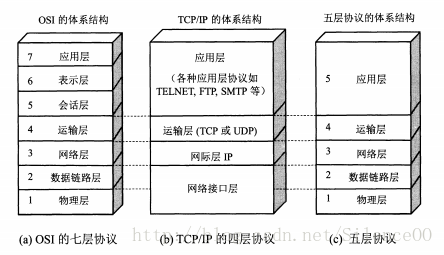

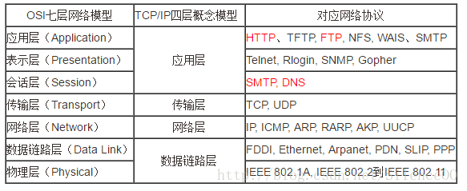

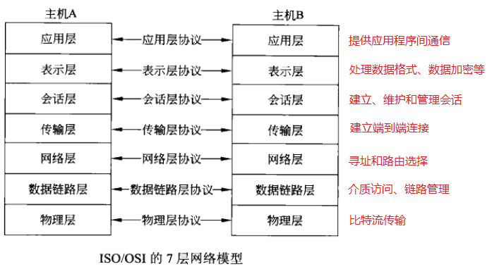

OSI 和 TCP/IP 的一个巨大区别：OSI 在网络层支持面向连接和无连接，在传输层只支持面向连接，而 TCP/IP 正好相反。

## 2. 各层次重要概念及协议

### 2.1 物理层

#### 基带传输、频带传输与宽带传输

**带宽**：信号包含的最高频率与最低频率之间的频率范围

**基带信号：**没有经过调制的信号（模拟或数字），效率低但近距离衰减小，近距离传输常用：监视器、打印机，大多数局域网（以太网、令牌环网），不适合远距离通信

**频带信号：**调制后的信号（模拟），速率低、误码率高，需要调制解调器，但是价格便宜

**宽带传输：**大于音频（4kHz）的频带传输，比基带传输距离更远


#### 串行通信与并行通信

**串行通信：**一次传1位，只要1根数据线，适合远距离传输

**并行通信：**一次传8位二进制数据，需8根数据线，主要用于近距离通信，如计算机内部


#### 单工通信、半双工通信与全双工通信

**单工通信：**单向通信，如广播和电视

**半双工通信：**双向通信，单同一时刻只允许一个方向，用于计算机非主干线路

**全双工通信：**双向通信，可同时双方向，主要用于计算机与计算机之间的通信


#### 同步通信与异步通信

**同步通信：**要求接收端时钟频率和发送端一致

**异步通信：**不要求时钟频率一致


#### 数据传输速率

**信号带宽：**信号最高频与最低频之差

**信道带宽：**信道所允许的上限频率和下限频率


#### 奈奎斯特准则与香农定律

用以描述“带宽”和“速率”之间的关系，两者最小值为实际可传输速率的最大值。

**奈奎斯特准则：**描述了**有限带宽且无噪声信道**的最大数据传输速率与**信道带宽**之间的关系
$$
R_{max}=2H \times log_2V
$$
*H*：信道带宽（Hz）

V：码元个数，例如采用 5 位二进制数编码时，不同码元个数为 2^5^ 个，{00000，00001，……，11111}

**香农定律：**描述了**有限带宽且有随机热噪声信道**的最大传输速率与**信道带宽及信噪比**之间的关系
$$
R_{max}=H\times log_2(1+S/N)
$$
*H*：信道带宽（Hz）

*S/N*：信噪比，$10\times lgS/N$ 的值为分贝

**完美传输线路：**不含噪声，例如 3kHz ，最大传输速率为 $2\times3kHz\times log_22=6kHz$ ，因此仅仅提高信号采样率是无法提高数据传输速率的，应该增大码元的长度。


#### 宽带接入技术

**基于双绞线的ADSL接入技术：**双绞线，采用**频分复用FDM**和**离散多音频DMT**，属于物理层，下行1~8Mbps，上行慢。

**基于HFC网的 Cable Modem接入技术：**HFC是**光纤与同轴电缆混合网**

**基于五类线的以太网接入技术：**10~100Mbps的上下行速率

**光纤接入技术：**无源光网络**PON**，基于ATM的无源光网络工**APON**，基于以太网的无源光网络**EPON**（物理层采用PON，链路层采用以太网协议），最流行的EPON是**GE-PON**

**FTTx+ETTH接入技术：**光纤到楼**FTTB**，光纤到路边**FTTC**，已到位到用户**ETTH**


### 2.2 数据链路层

#### 差错控制与纠正

**差错检测技术：**最常见的检错码技术为==**CRC**==（循环冗余校验码），检测出错则请求重发。

**差错纠正技术：**最常见的纠正技术是==**海明编码方案**==，**码字**和**海明距离**两个概念。


#### 成帧与帧同步

**成帧和帧同步：**最具代表的为**含位填充的分界标识法**，也称==**0比特插入法**==。用来确认一帧的起始和终止


#### 帧重传

**反馈重传：**接受方向发送方发送一个确认帧 **ACK**，否则会一直重传

**自动重传：**引入一个计时器，在计时器规定时间内没有接到**ACK**，则自动重传


#### 流量控制

为了解决发送方发送速度快于接收方接受速度的问题。

**基于反馈的流控制：**基于**回退N帧技术的机制**，基于**选择性重传技术的机制**，这两种统称为**滑动窗口机制**

**回退N帧技术的机制：**接收方收到坏帧时丢弃其后所有后续帧，并请求重传

**选择性重传技术的机制：**接收方只丢弃坏帧，并请求重传坏帧

**稍带确认机制：**在某个帧的头部稍带对前一个帧的确认。

**发送窗口机制：**发送方维持一组序列号，对应发送方允许它发送的帧

**接收窗口机制：**接收方维持饿一组序列号，对应接收方允许接受的帧


#### 链路管理

**高级数据链路控制协议 HDLC：**由**异步数据链路控制协议 SDLC** 扩展开发而成，有如下特性：

 - 不依赖任何一种字符编码集
 - 支持全双工通信
 - 所有帧采用 CRC 校验
 - 传输控制功能与处理功能分离，具有较大灵活性

定义了主站（只可发）、从站（只可收）、复合站（可发可收）

定义了信息帧（I帧，传送信息数据）、监控帧（S帧，差错控制和流量控制）、无编号帧（U帧，链路的建立、拆除、监控）

**点到点链路控制协议 PPP：**

- 使用**链路控制协议LCP**建立、维护与释放链路
- 使用**网络控制协议NCP**为其上网络层提供服务接口
- 对于**互联网络数据包交换协议IPX**提供IPXCP接口，帧以 HDLC 帧格式为基础，做了少许改动。

**介质访问控制协议 MAC：**局域网的数据链路层分为：

- **逻辑链路层LLC**（负责为网络层提供统一的接口） 
- **介质访问控制层MAC** （负责解决当局域网中因共用信道的使用而产生竞争时，如何分配信道使用权的问题）
  - 有线局域网中广泛采用的介质访问控制协议为 **CSMA/CD** (带冲突检测的 CSMA)，基本思想为：**当一个站要发送数据时，首先监听信道，如果信道空闲，就发送数据，并继续监听。如果数据发送过程中监听到了冲突，则立刻停止数据发送，并在等待一段随机的时间之后再重新开始尝试发送数据。**
  - 无限局域网中广泛采用的为 **CSMA/CA** （MACA），与 CSMA/CD 最大的不同是在于采取**避免冲突**的工作方式。其基本思想为：**发射端首先检测介质是否空闲，若空闲送出RTS信号，其中包含发射端的地址、接收端的地址和下一笔数据将持续发送的时间，接收端收到RTS信号后，发出响应信号CTS，发射端收到CTS信号后，开始发送数据，接收端接收完数据包后，用CRC检测数据包是否正确，正确则响应ACK包。若发射端没有收到ACK包，则认为包丢失一，一直重新发送包。**
  -  **CSMA/CD** 和 **CSMA/CA** 的区别：前者用过电缆中电压的变化来检测数据是否发生碰撞，后者采用能量检测、载波检测和能量载波混合检测三种方式检测信道空闲的方式。都是有竞争协议。
  - **无冲突的介质访问协议：**无冲突计数
    - 基本位图法协议
    - 二进制倒计数
  - **有限竞争协议：**低负载时使用竞争协议获得较短的延迟，高负载时使用无冲突技术货到较高的信道利用率。例如**自适应数搜索解析**


### 2.3 网络层

#### IP协议

尽力而为的将数据分组从源端传送到目的端。

**IPv4协议：**每个分组均包含了一个头部和一个数据部分，其中头部长度为20~60字节，包括了一个20字节（160比特）的定长部分和一个可选的变长部分（不超过40字节）。

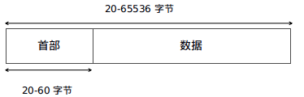


- 版本：记录IP分组属于哪个版本的协议
- 头部长度（HLEN）：用于指明头部的长度，最小值为5（0101），最大值为15（1111），单位为4字节，即5x4=20字节，16x4=60字节
- 服务类型：用于定义IP分组的优先级与源主机关心的网络质量信息
- 分组总长度：用于记录IP分组中所有内容的总长度，最大长度为65536字节
- 标识域：用于让目标主机确定一个新到达的分段属于哪个分组。属于同一个IP分组的所有分段均包含相同的标识值
- 标志域：用于标识分组是否包含了分段，若包含了分段，则除了最后一个分段之外，分组的所有分段必须为8字节的整数倍，即必须采用8字节作为基本分段单位
- 分段偏移量：表示一个分组最多可分为8192个分段
- 生存时间：单位为秒，表示每个分组的最大生存时间
- 协议：指明该分组应递交给传输层的哪个协议（进程）处理
- 头部校验和：用于校验分组头部的正确性
- 源IP地址：用于记录源主机的IP地址
- 目标地址：目标主机的IP地址
- 可选项：附加信息的补充，例如分组的安全信息已经分组路由过程必须遵循的完整路径信息

**IPv6协议：**头部长度固定为40字节。

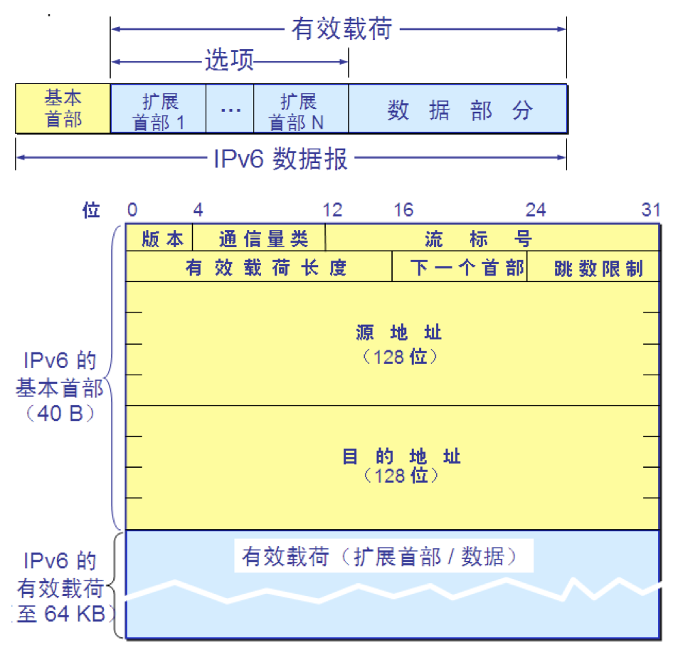

- 版本域：记录IP分组属于哪个版本的协议
- 服务类型域（通信量类）：用于指示IPv6数据流通信类别或优先级，功能类似于IPv4的服务类型域
- 流标记：用于标记需要IPv6路由器特殊处理的数据流(如音频或视频等实时数据)的信息包顺序，以非‘0’标记，不要求做特殊处理则置为‘0’
- 负载长度：最多可表示65535字节负载长度，超过这长度时置为0，使用扩展头逐个跳段（Hop-by-Hop）选项中的巨量负载（Jumbo Payload）选项，使用这个选项，分组有效载荷长度最大可达4 294 967 295字节
- 下一分组头：识别紧跟IPv6头后的分组头类型，例如扩展头或某个传输层协议头（TCP、UDP等），RFC 2460中定义了以下6个IPv6扩展头：Hop-by-Hop（逐个跳段）选项分组头、目的地址项分组头、路由分组头分段分组头、认证分组头已经ESP（封装安全载荷）协议分组头。
- 跳步限制：类似IPv4的生存时间域，分组每经过一次转发，该域中的值减1，直到为0时丢弃。
- 源地址：用于记录源端的IP地址。
- 目的地址：用于记录目的端的IP地址，如果存在路由扩展头，目标地址可能是源端路由表中下一个路由器的接口地址。

**IPv6 对比 IPv4 的优势：**

- 地址数量多
- IPv4使用ARP协议来查找与IPv4地址相关联的MAC地址，IPv6使用**因特网控制报文协议版本6（ICMPv6）**将这个功能嵌入到IP自身作为无状态自动配置和邻节点发现算法的一部分
- 更高的网络吞吐率


#### IP地址

为了便于寻址以及层次化构造网络，每个IP地址包括两个标志码，即网络ID和主机ID。同一个物理网络上的所有主机都拥有一个相同的网络ID与一个不同的主机ID。根据网络ID的不同可以进一步细分为5种类型：A类、B类、C类、D类、E类。

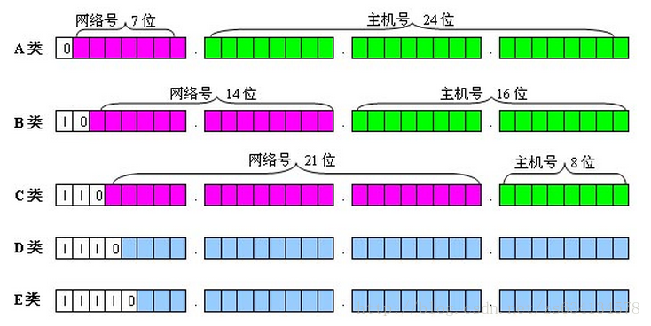

| 类别 | 最大网络数 | IP地址范围                | 最大主机数 | 私有IP地址范围              | 子网掩码      |
| ---- | ---------- | ------------------------- | ---------- | --------------------------- | ------------- |
| A    | 2^7^-2     | 0.0.0.0-127.255.255.255   | 2^24^-2    | 10.0.0.0-10.255.255.255     | 255.0.0.0     |
| B    | 2^14^-2    | 128.0.0.0-191.255.255.255 | 2^16^-2    | 172.16.0.0-172.31.255.255   | 255.255.0.0   |
| C    | 2^21^-2    | 192.0.0.0-223.255.255.255 | 2^8^-2     | 192.168.0.0-192.168.255.255 | 255.255.255.0 |

- A类地址：1字节的网络地址和3字节的主机地址，网络地址最高位必须为0，最后一个是广播地址，适用于大规模的网络。
- B类地址：2字节的网络地址和2字节的主机地址，网络地址最高位必须为10，最后一个是广播地址，适用于中型规模的网络。
- C类地址：3字节的网络地址和1字节的主机地址，网络地址最高位必须为110，最后一个是广播地址，适用于小型规模的网络。
- D类地址：第一个字节必须以 1110 开始，不分网络地址和主机地址，是一个专门保留的地址，范围为224.0.0.0到239.225.225.225。主要用于多点广播（多播）之中作为多播组的IP地址。
- E类地址：第一个字节必须以11110开始，为将来使用保留。
- 全零地址（0.0.0.0）：对应于当前主机，全1地址（255.255.255.255）用做当前子网的广播地址。

##### 单播、组播与广播

**单播：**主机之间一对一的通信模式，例如用户主机和Web服务器之间。

**组播：**一对一组的通信模式，例如网上视频会议和视频点播，多播地址用D类IP地址表示。

**广播：**主机之间一对所有的通信模式，广播地址用255.255.255.255表示。


#### 分组交换

是一种以分组为单位进行信息传输和交换的方式，即，将到达分组交换机（路由器）的分组先送到存储器暂时存储和处理，等到相应的输出电路有空闲时再送出。


#### 子网和子网掩码

为了防止IP地址的浪费，出现了子网和子网掩码。基本概念是：从主机位中借用几位作为子网位，变成**网络ID + 子网ID + 主机ID**，再提出子网掩码的概念，子网掩码是一个32位的二进制字符串。左边连续的 “1” 个数表示网络ID+子网ID的位数，右边连续的 “0”个数表示主机ID的位数。

因此可以通过主机ID的位数来快速确定一个子网中有多少主机。

可以将目标 IP 地址与子网掩码进行 AND（逻辑与）运算，得到网络号和子网号。


#### NAT 与网络地址转换

为了让更多主机连上互联网，分配了三段私有地址，可以通过这些私有地址来搭建一个内部局域网。内部局域网的主机可以通过公用一个真实IP上网。

而这个这之间的数据交互就需要用到真实IP地址和局域网IP地址的交换，这一般是通过NAT服务器实现的。局域网内发送数据到外部时，NAT服务器会把局域网IP+端口号替换为一个16位的索引值（0~65535）存储在自己的NAT映射表中，再用索引值替代外发分组中的端口号值。外部应答后，逆向操作。


#### 路由算法

负责通过各种参数作为度量值来决定一个进来的分组应该选择哪条路径作为到达目的节点的实际路径，其中常用的度量值有：

- 跳数：分组从源结点到达目的节点经过的路由器个数
- 带宽：链路的传输速率
- 延时：分组从源结点到达目的结点所花费的时间
- 负载：通过路由器或线路的单位时间通信量
- 可靠性：传输过程中的误码率
- 开销：传输过程中的耗费，与所使用的链路带宽相关

##### 路由算法的分类

根据网络节点对网络拓扑和通信量变化的自适应能力的不同：

- **静态路由选择算法：**也叫非自适应路由选择算法，网络结点之间的路由是事先算好的，特点是实现简单和开销较小，但不能及时适应网络状态的变化。代表有**最短路径选择算法**和**洪泛路由选择算法**
- **动态路由选择算法：**也叫自适应路由选择算法，特点与静态路由算法相反。代表有**距离矢量路由选择算法**和**链路状态路由选择算法**

根据网络节点路由决策方式的不同：

- **集中式路由选择算法：**每个网络节点都拥有网络中所有其他路由器的的全部信息和整个网络的流量状态，因此可以根据网络的全局信息进行决策。
- **分布式路由选择算法：**每个网络节点只拥有与它直接相连的路由器信息，因此只能根据网络的局部信息来决策。

根据网络节点的组织结构与功能作用的不同：

- **平面路由选择算法：**每个网络节点具有完全相同的功能和地位。优点是算法设计简单，健壮性好，缺点是路由的建立、维护开销很大，数据传输跳数多，主要适合小规模的网络。
- **层次路由选择算法：**网络节点按照不同的分簇方法分为不同的簇，网络的逻辑结构是层次的，普通节点只负责簇类路由（一级路由），每个簇类只有少部分节点负责簇间路由（二级路由）

根据网络节点所选取的传输路径数量的不同：

- **单路径路由选择算法：**网络节点一般只利用一条路径进行数据传输，优点是算法设计简单，易于管理配置，缺点是无法并行或并发的发送数据，导致网络传输效率低，延迟增加，网络负载不平衡，容易造成网络拥塞，无法很好的支持QoS。
- **多路径路由选择算法：**多路径进行数据传输，可以平衡网络负载，充分利用网络资源，改善通信能力。

##### 具体的算法

- **最短路径路由选择算法：**把整个网络看成一张图，每个节点之间的连接有不同的权重，然后找寻最短路径。著名的有：Dijkstra算法。

- **洪泛路由选择算法：**是一种分布式的路由选择算法，每个节点用广播形式转发收到的分组，并丢弃收到的重复分组。缺点是效率低，但是健壮性高，可以作为衡量标准来评价其他路由算法。

- **距离矢量路由选择算法：**基本思想是：每个路由器维护一张矢量表（X,Y），其中X表示当前已知的到每个目标路由器的最佳距离，Y表示所使用的线路（即到达该节点的上一跳节点），通过邻居之间的相互交换信息，路由器可以不断地更新各自维护的矢量表。但是存在一个严重的缺陷：收敏速度慢，尤其是对于坏消息的反应非常迟缓，而且还存在无穷计数问题。路由信息协议 **RIP** 是这一算法的典型代表，协议中规定最大跳数是 15 跳，超过15跳时便会丢弃这一分组。

- **链路状态路由选择算法：**是目前**使用最广**的一类域内路由协议，通过采用一种类似“拼图”的设计策略来实现。每个路由器将其收到的所有邻居节点的链路状态向全网的其他路由器广播，于是，一个路由器就能收到全网路由器的信息，并将其拼装，得到一个全网拓扑视图，进而通过最短路径算法计算其他任意路由器的最短路径。路由器向其他路由器广播的内容除了邻居节点及其延迟或者开销外，还应该包括“序号”和“年龄”两个字段：

  - **序号：**用来判断分组是重复的还是新的，重复的会被丢弃。
  - **年龄：**一个分组经过每个路由器后均递减年龄，若变成0则会被丢弃。因此，年龄可以确保所有分组在定长时间内消失。

  **OSPF协议**是一种典型的链路状态路由选择协议，其中的度量标准为带宽和延迟，相比RIP，OSPF更适合大型网络。

- **层次路由选择算法：**路由被分为不同的区块，每个区块内的路由器知道如何把分组传到自己区域内的目标路由，但是对其他区块内的路由不知情。

- **广播路由选择算法：**基本思想是给网络中所有的主机发送分组，代表性的路由选择算法有**生成树算STP**和**逆向路径转发RPF**。

  - **STP：**首先构建一个生成树，生成树是子网的子集，但是不包含任何环，将收到的广播分组复制到除了进入线以外的其他分组线。这样可以最佳的使用贷款，但问题就是：每个路由器都要事先构建自己的汇集树。
  - **RPF：**当一个广播分组到达一个路由器的时候，对分组进行检查，若是新分组则转发到除了到来的那条线路之外的所有其他线路上，否则丢弃。采用此算法不需要实现构建一棵汇集树。

- **多播路由选择算法：**代表性的算法为**生成树算法**。

- **移动主机的路由选择算法：**主代理、外地代理、隧道机制。第一次发送给主代理，主代理通过隧道机制发送给外地代理，道第一次传输过后，以后可以直接发送给外地代理


#### 拥塞控制策略

**开环策略：**一开始就预防拥塞问题的发生

**闭环策略：**当拥塞问题发生后，调整系统运行，以消除拥塞，主要调整方法有以下两种：

- 显式反馈：由拥塞点发送分组警告源端
- 隐式反馈：由源端自行观测

**数据报子网中的拥塞机制：**

- 抑制分组：输出线路如果过载，返回源主机一个抑制分组。缺点是，当路由器离源主机较远时，反应过慢。
- 逐跳抑制分组：抑制分组不返回到源主机，而是传回途中的每一个路由器。
- 负载丢弃：拥塞实在无法消除时，丢弃分组。葡萄酒策略优先丢弃新分组，牛奶策略优先丢弃老分组。


#### 流量控制策略

网络服务质量**QoS**，主要包括以下四个因素：

- 可靠性
- 延迟
- 抖动
- 带宽

**流量整形技术：**保障主机以尽可能均衡的速率发生数据，从而提高网络的服务质量。常见的算法有：

- 漏桶算法：缺点是不能应对网络中的突发流量
- 令牌桶算法：解决了漏桶算法的问题


#### 网络互连

##### 网络互连设备

- 中继器：物理层设备，放大信号所用，但是会增加冲突，所以不能太多，任意两个工作站之间最多四个。
- 集线器：物理层设备，一种多口的集线器，优点是当某条传输介质发生故障时，不会影响到其他节点。
- 网桥：数据链路层设备，用于连接两个或两个以上具有相同类型（通信协议、传输介质及寻址结构）的**局域网**。
- 二层交换机：数据链路层设备，功能类似网桥，当有比网桥更好的性能，用于连接相同类型的局域网，例如以太网和以太网相连。
- 三层交换机：网络层设备，具有部分路由器功能的交换机。
- 路由器：网络层设备，可以连接不同类型的局域网和广域网，例如把以太网和FDDI网络相连。
- 网关：网络层设备，可以将不同网络体系结构的网络相连，例如IPv4网和IPv6网。


#### 网络管理

网络层的常用网络管理协议：

- **Internet 控制消息协议 ICMP：**用于在IP主机、路由器之间传递控制消息。实际上一个“错误侦测与回报机制”，ICMP提供一致易懂的出错报告信息，发送方根据错误信息确定如何更好地重发失败分组。ICMP唯一的功能是报告问题，无法纠正错误，纠正错误的任务由发送方的传输层解决。
- **Internet 组管理协议 IGMP：**负责IP组播成员管理的协议，主要用来在IP主机和其直接相邻的组播路由器之间建立、维护组播组成员关系。
- **地址解析协议 ARP：**用于将IP地址映射到网卡的MAC地址的协议。先查看自己的ARP表，有则直接转发，否则广播一个请求报文，等待回应后，取回应中得到的信息保存一份，然后再转发。
- **反向地址解析协议 RARP：**将局域网中的某个主机的网卡地址转换为IP地址，例如某台主机知道自己的网卡地址而不知道IP地址时可以发送一个请求报文，来询问自己的IP地址，RARP服务器收到后返回对应的IP地址。此协议被广泛应用于获取无盘工作站的IP地址。


#### IP 分片与重组

IP协议在传输数据包时会把报文分为若干分片进行传输，然后在目标系统进行重组。分片的原因是物理线路的材质因素限制了所能传输的最大帧长度，这个最大帧长度被称为最大传输单元MTU。


### 2.4 传输层

#### TCP、UDP

##### TCP

是一种面向连接的、可靠的、基于字节流的传输层协议。通信双方首先需要建立连接，然后才能开始数据的传输，并且还要在传输完成后拆除连接。另外还采用超时重传机制（超时自动重传）和确认机制（收到确认之后才会认为成功）。

**基于TCP的常见协议：**FTP(20)、Telnet(23)、SMTP(25)、HTTP(80)、POP3(110)

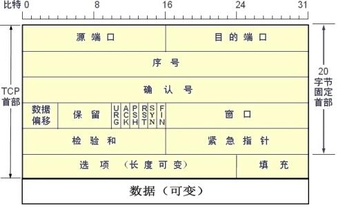

TCP报头为20~60字节。

- 源端口：发送方端口号
- 目的端口：接收方端口号
- 发送序号（**Seq**）：用序号对每个字节计数，发送序号的值表示报文段中第一个字节是整个字节流中的第几个字节
- 确认号（**Ack**）：用于标识期望收到的下一个报文段的第一个字节，并声明前面的数据都已准确无误的收到。因此确认号一般为上次收到的字节号+1。确认号只有在ACK标识被设置时才有效。
- 数据偏移：用于标识TCP头部的长度，为了上面两个字段的准确性。
- 保留：目前未做定义，置为0.
- 控制位：包含6个1比特的标志位，每个标识位都可以打开一个功能
  - URG：用来保证TCP连接不被中断，督促中间设备尽快处理这些数据
  - ACK：取1时表示应答有效
  - PSH：表示Push操作，指在数据包到达接受端后，立即送给应用程序，而不是在缓冲区排队
  - RST：表示连接复位请求，用来复位那些产生错误的连接，也被用来拒绝错误和非法的数据包
  - SYN：表示同步序号，用来建立连接
  - FIN：表示发送端已经发送到数据末尾，数据发送完成，发送FIN标识位的TCP段，连接将被断开
- 窗口：用于TCP流量控制，目的主机使用该字段告诉源主机从被确认的字节开始计算起，下次可以发送多少字节
- 校验和：用于错误检查，检查数据是否出错
- 紧急指针：是一个可选指针用于指示报文段类的最后一个字节位置，只在URG标志被设置时才有效
- 选项：用于标识哪个选项有效，0表示没有选项，1表示无须再由的操作，2表示下4个字节包括了源主机的最大报文段长度MSS（TCP协议默认为536字节）。
- 填充：加入额外的0，以保证TCP头是32的整数倍


##### UDP

一种不可靠无连接的传输层协议，提供面向事务的简单不可靠信息传送服务，不对传送的分组进行可靠性与顺序保证，不考虑流控制、错误控制，也没有重传机制。优点是因控制选项少，而且无需建立连接，因此延迟小、效率高。适合对可靠性要求不高，或者网络质量有保障，或实时性要求较高的应用程序。例如：DNS、SNMP、视频会议等。

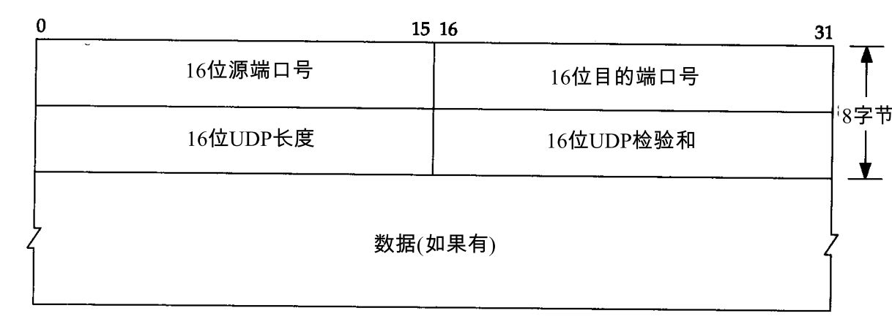


#### TCP的三次握手和四次挥手

为了建立TCP连接，通信双方必须从对方了解如下信息：

- 对方报文发送的开始序号
- 对方发送数据的缓冲区大小
- 能被接收的最大报文段长度MSS
- 被支持的TCP选项

TCP将通过通信双方的三次TCP报文段的交换来实现对以上信息的了解，并在此基础上建立一个TCP连接。

- **第一次握手：**发起方A向接收方B发送一个TCP同步报文段SYN，SYN控制位的值设为1，并把“发送序号段”设为一个随机生成的32位值 **X**，确认字段设为0。MSS字段指明发起方允许接收的TCP报文段的最大长度。
  - 简写为：SYN、Seq=X
- **第二次握手：**接收方接收SYN报文后，回送SYN-ACK报文段给发送方，即SYN控制位值设为1，ACK控制位值设为1，Ack字段的值设为 **X+1**，Seq字段设为32位随机值 **Y**。MSS字段指明接收方允许接收的TCP报文段的最大长度。
  - 简写为：这其实是两个组，优化合一了。[SYN、Seq=Y] + [ACK、Ack=X+1]
- **第三次握手：**发起方A收到SYN-ACK报文后，向接收方B发送一个ACK报文。在此报文中确认发起方使用的最终TCP参数，同时也向B确认它该使用同样的参数，自此TCP连接建立完成。例如A设置随机生成的32位X值再加上1，即X+1，而确认号字段设置B随机生成的32位值Y再加上1，即Y+1。
  - 简写为：ACK、Ack=Y+1

> 三次握手若存在包丢失，就会重传，但是第三次包丢失不会重传第三次包，因为TCP不会重传单独无数据的ACK包，而是重传第二次的包，以再次出发第三个包的发送机制。
>
> 另外，X+1和Y+1将作为报文开始发送的序列号。
>
> 必须认识到的是，ACK确认必须和Ack+1结合起来才能生效，否则发送方不知道接收方ACK的到底是哪一个包。
>
> 为什么是三次握手而不是两次？
>
> - 防止过期的连接再次连接到主机，比如A端发送的第一个包SYN1，B没有收到，那么A会再发一个包SYN2，然后建立连接，传输完后连接中断。可如果这时候B收到了SYN1，会以为是一个新的连接，并返回ACK，A收到这个ACK会直接丢弃掉，这样就会导致B端一致等待，浪费网络资源。
> - 因为去除掉最后一次的话，如果第二个包丢失，Ａ和Ｂ的初始序列号就无法达成一致。
> - 于是，可以知道，使用两次握手，出现任何一个包丢失的情况，都将导致问题。

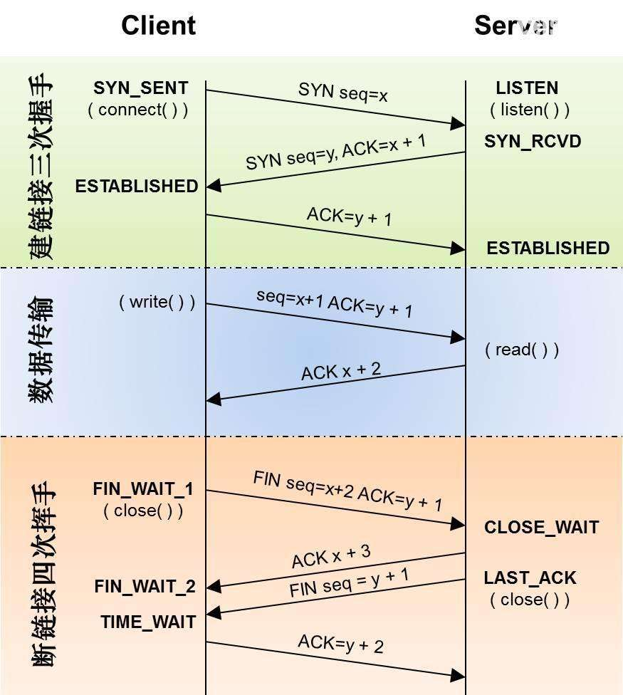

- 第一次挥手：主动端A发送设置了FIN位的连接请求释放报文**FIN**，表示希望终止连接，然后进入**FIN_WAIT1**状态。
- 第二次挥手：远端B收到**FIN**报文后，发送一个**ACK**报文，进入**CLOSE_WAIT**状态，此时从B端单向连接正式终止，不再接收报文。Ａ端收到**ACK**报文后，进入**FIN_WAIT2**状态，不再发送报文，但仍然可以接收报文。处于一种HALF_CLOSE连接状态。
- 第三次挥手：远端B进行了最后的数据发送后，发送一个**FIN**报文，进入**LAST_ACK**状态。
- 第四次挥手：主动端A收到**FIN**报文后，回应一个**ACK**报文，远端B就此进入**CLOSED**状态，该TCP连接完全关闭。为了防止最后的包丢失，导致远端重发**FIN**的情况，主动方会在发送完**ACK**后进入**TIME_WAIT**状态。

> 为什么是四次挥手而不是三次？因为主动方A发起第一个**FIN**时，被动方B可能还有数据没有发完，若不回复就会导致A判断超时丢包而重发，所以需要先发送一个**ACK**，等剩余数据发送完再发送一个**FIN**，最后A再回复**ACK**。


#### 两军问题

无论是三次握手还是四次挥手，均不能完全保障TCP连接建立与释放的正确性。实际上也不存在一个完全正确的TCP连接建立与释放协议。所有的协议均会存在“两军问题”。


#### 报文分段与重组

与IP分片重组受MTU单元大小影响类似，报文分段重组受MSS长度影响，而MSS影响也收MTU大小影响。


#### 重传机制

动态设定超时重传的值：
$$
RTT=\alpha \times RTT+(1+\alpha)\times M
$$
*M*：当前测量到的RTT值

$\alpha$：平滑因子，表示老RTT值在新RTT值得估算中所占的权重

如果计时器超时前没有收到确认，则将RTT的值翻倍。


#### 拥塞控制机制

处理网络层提供的拥塞控制机制：开环和闭环

传输层的有==**慢启动算法**==，阀值和减半。


#### 流量控制机制

处理网络层提供的流量控制机制：漏桶和令牌桶

通过TCP报文段中的确认号（Ack）和窗口字段来告诉发送方应该发送多少数据，从而达到流控的目的。


#### 虚拟专用网络

VPN


### 2.5 应用层

#### 常见协议

##### FTP

文件共享协议，端口20（数据）和21（控制命令），基于TCP

##### TFTP

简单文件共享协议，端口69，基于UDP

##### Telnet

远程登录协议，端口23，基于TCP

##### SSH

安全外壳协议，端口22，基于TCP

##### DNS

域名解析，端口53，基于UDP

##### HTTP

超文本传输协议，端口80，基于TCP

##### SMTP(25) 和 POP3(110) / IMAP(143)

邮件收发，基于TCP

##### SNMP

一套网络管理协议，161端口接收和发送请求，162端口接收告警，基于UDP

##### DHCP

为主机自动分配IP。


# 二、其他概念

## 1.常见网络攻击和防范措施

### 1.1 拒绝服务攻击-DOS攻击

#### 死亡之ping

原理：发送了超过IP协议规范所规定长度的包

防范：打系统补丁

#### SYN拒绝服务攻击

原理：攻击者发起第一次握手，接收第二次握手，但是不发起第三次握手，这样目标主机就要不断的重发第二次握手，而攻击者继续发起多次第一次握手，浪费目标系统的资源，甚至导致瘫痪。

防范：通过防火墙、路由器等过滤网关防护，或者通过加固TCP/IP 协议栈，但是并不能完全阻止，只能减轻危害。

#### ICMP洪水

原理：运行一些网络诊断程序事，会发出ICMP响应请求报文（ICMP ECHO），计算机接收到ICMP ECHO后，会回应一个ICMP ECHO Reply报文。这个过程是需要CPU处理的，有时可能消耗掉大量的资源，比如处理分片的时候。于是便可以利用大量发送ICMP ECHO报文来进行攻击。

防范：没有有效的防范措施，禁止ping就可以了，或者能够找到源IP，然后拉黑。

#### UDP洪水

原理：发送大量UDP报文。

防范：和上面类似，或者通过包大小判定。

#### 分片报文攻击

#### Land攻击

发送目标地址和原地址相同的TCP包。


### 1.2 针对协议的攻击

#### ARP攻击

发广播，伪造MAC，收到不应该自己收到的信息。

#### RIP路由攻击 和 OSPF路由攻击

用错误信息填充路由的路由表，达到攻击效果。

防范：开启HMAC路由验证。


### 1.3 网页攻击

#### ActiveX攻击

在ActiveX中插入恶意代码。

#### SQL注入

利用特殊的输入拼凑SQL语句，达到攻击效果。

#### 跨站脚本攻击(XSS)

恶意攻击者利用网站没有对用户提交数据进行转义处理或者过滤不足的缺点，添加一些恶意代码，使其他用户在访问时，执行响应的恶意代码，从而盗取用户资料，利用用户权限进行某种操作。盗取Cookies。

**解决办法：**绝不信任用户提交的任何数据，对用户提交的数据要进行充分的==过滤==。

- HTML实体转换为HTML实体编号，如

  - 空格 —— `nbsp;`
  - < —— `&lt;`
  - \> —— `&gt;`
  - & —— `&amp;`
  - “ —— `&quot;`
  - ' —— `&apos;`

- htmlentities(\$str)  和  html_entity_decode(\$str)

  前者把所有HTML实体转化为实体字符，后者反过来。

- htmlspecialchars(\$str) 和 htmlspecialchars_decode(\$str)

  前者把预定义的HTML实体转化为实体字符，后者反过来，只转化固定的几个字符，没有上面那个多。

- addslashes(\$str) 和 stripslashes(\$str)

  前者在预定义字符前加上反斜杠 \\，后者相反。

- strip_tags($str)

  直接去除其中的HTML标签。

#### 跨站请求伪造攻击(CSRF)

相比于XSS，CSRF是利用了系统对页面浏览器的信任，XSS则利用了系统对用户的信任。

比如你有100虚拟游戏币，通过以下url，你的游戏币会被转给ID为11的用户，一般这种操作在本页面正常逻辑操作下可以完成。但是如果你不想转这100个游戏币，但是你访问浏览器另一个Tab标签中的页面，该页面中隐藏了这么一条链接访问，这样游戏币就偷偷转过去了，从而达到了攻击效果。一般配合XSS攻击可以让这个攻击的条件更容易达成。

```url
http://www.game.com/Transfer.php?toUserId=11&vMoney=100
```

**如何防范：**

- 使用验证码
- 验证HTTP Referer字段
- 为每个表单添加令牌token并验证

#### Http Heads攻击

凡是用浏览器查看任何WEB网站，无论你的WEB网站采用何种技术和框架，都用到了HTTP协议.HTTP协议在Response header和content之间，有一个空行，即两组CRLF（0x0D 0A）字符。这个空行标志着headers的结束和content的开始。“聪明”的攻击者可以利用这一点。只要攻击者有办法将任意字符“注入”到 headers中。解决办法是过滤header ，除去其中的CRLF。

#### Cookie攻击

通过盗取你的Cookies，得到你的权限。

现在多数浏览器都支持在cookie上打上HttpOnly的标记,凡有这个标志的cookie就无法通过Java Script来取得,如果能在关键cookie上打上这个标记，就会大大增强cookie的安全性。

#### 上传文件攻击

文件名攻击,上传的文件采用上传之前的文件名,可能造成:客户端和服务端字符码不兼容,导致文件名乱码问题;

文件名包含脚本,从而造成攻击。


## 2. 常见加密技术

### 2.1 概念

#### 对称加密和非对称加密

对称加密：加密和解密用同一个密钥

非对称加密：加密解密用不同的密钥

#### Hash散列和密钥相关的散列

散列：对任意长度的数字得到一个固定长度的摘要，如MD5，SHA

密钥相关的散列：相当于加盐的散列，这个盐就是密钥，如HMAC

> 应对弱密码和彩虹表：加盐
>
> 应对暴力破解：慢哈希
>
> 散列最大的问题是冲突碰撞，所以设计算法时要尽量避免冲突碰撞


### 2.2 经典加密算法

#### RSA

利用大整数进行质因数分解的难度来设计的。

有两种用法：公钥用来加密，私钥用来解密。私钥用来前面，公钥用来验证。

#### AES 和 DES

AES是DES的替代品


## 3. 链路层的几种网络

### 以太网（Ethernet）

当今现有局域网采用的最通用的通信协议标准，使用CSMA/CD（载波监听多路访问及冲突检测）技术。


### ATM（异步传输模式）

ATM是一种用于在LAN或WAN上传输声音、视频图像和数据的新型宽带分组交换技术，采用**异步时分复用方式**是实现**宽带综合业务数字网B-ISDN业务**的核心技术之一。采用**面向连接的虚电路传输方式**，将数据分割成固定长度的信元，ATM信元和 Internet 中的IP分组类似，但又与 Internet 中分组长度是可变的情形不同，ATM信元固定长度53字节，包括长度为 5 字节的信头部分和 48 字节的信元净荷部分。

**优点：**吸取电路交换实时性好，分组交换灵活性强

**缺点：**信元首部开销太大；技术复杂且价格昂贵


### 令牌环网（Token Ring）


### 光纤分布式接口网络（FDDI）


## 4. 网络拓扑

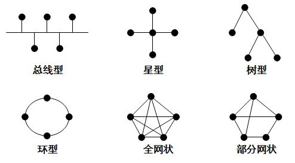

### 总线型拓扑

安装简单，需要铺设的线路短，成本低，单台计算机的故障不会影响整个网络的运行。

通信线路的故障会导致整个网络的故障。

### 环形拓扑

容易安装和监控。

容量有限，难以增加新的结点，一个节点出问题，网络就会出问题，而且不好诊断故障

### 星型拓扑

每台计算机直接连接到网络中，若一台计算机出问题，不会影响整各网络运行。

中心故障，网络就出问题，同时共享能力差，通信线路利用率不高。

### 网型拓扑

结点之间多条通信线路相连，因此网络可靠性较高。

不足在于网络拓扑结构复杂，建设成本高。

### 树形拓扑

任意两个结点之间不产生回路，特点是扩充方便、灵活、成本低、易推广、适合于分主次或分等级的层级型管理系统。

容易诊断错误，对根部要求高。

### 蜂窝型拓扑

无线局域网的一种常用网络拓扑结构。

### 混合型拓扑

同时兼具多种单一网络拓扑结构的优点。


# 三、网络编程


# 四、最新Web技术

## WebAssembly 

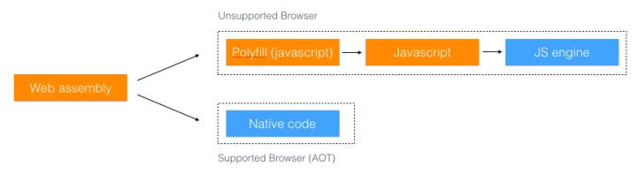

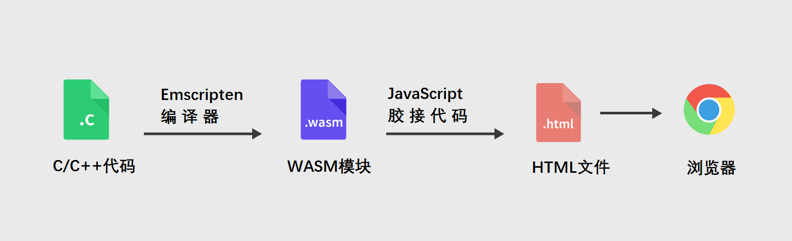

说白了就是用C等其他语言编写的模块函数编译成WASM模块后，JS可以调用这些模块中的函数，由于这些函数已经很接近与机器码了，所以执行速度相当快。


# 五、常见术语

**P2P网络：**应用层的对等网络形式。

