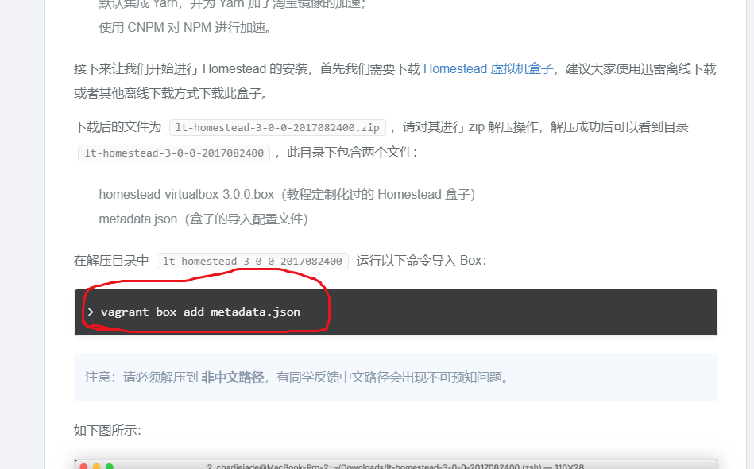
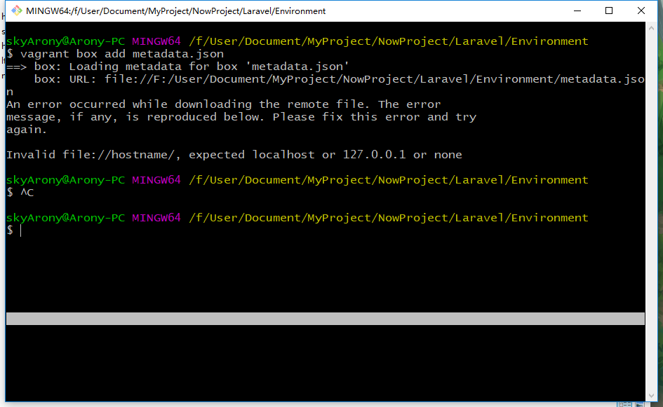
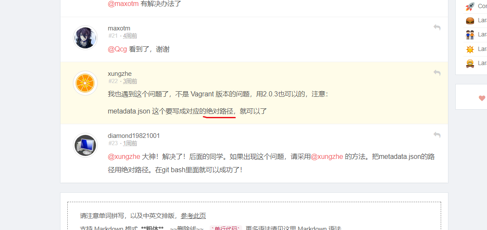
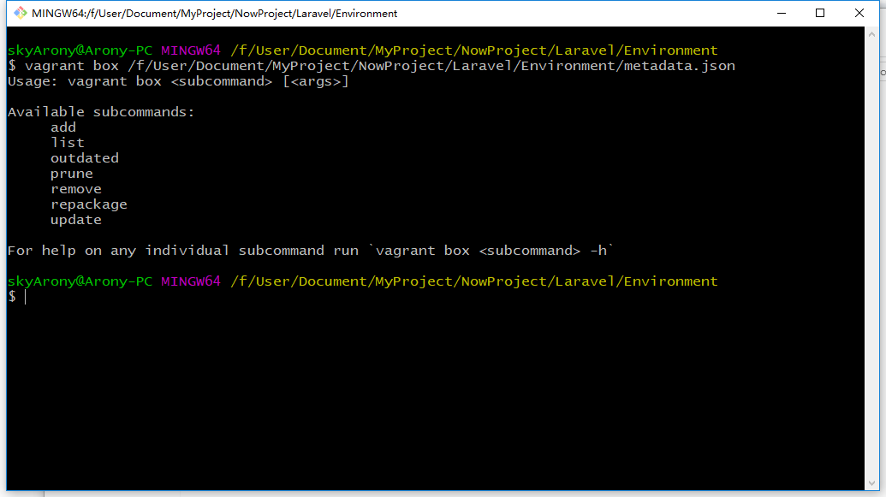
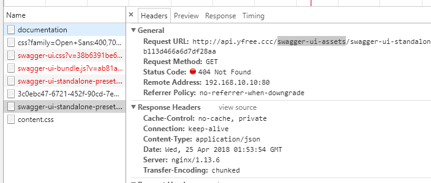

前面在 [Laravel-Lumen教程1-基础环境搭建](/2017/12/30/Laravel-Lumen教程1-基础环境搭建) 一文中，我用 Docker 和 phpStudy 搭建了开发环境，今天决定再尝试用 Homestead 来搭建一次开发环境，主要是看了[社区的建议](https://laravel-china.org/docs/laravel-development-environment/5.5)。

[社区的建议](https://laravel-china.org/docs/laravel-development-environment/5.5)中非常完整详细的介绍了安装步骤，所以我并不需要锦上添花，在此仅仅提取概要，便于快速翻阅，另外记录我所遇到的问题。


# 一、基础环境

## 1. 步骤概要

1. 安装 VirtualBox
2. 安装 Vagrant
3. 导入 Homestead Box 虚拟机盒子
4. 安装 Git
5. 安装 Homestead 管理脚本
6. 配置 `Homestead.yaml` 文件
7. 启动 Homestead 虚拟机


## 2. 遇到的问题

### 导入 Box 时报错

#### 执行步骤



#### 报错内容

```shell
$ vagrant box add metadata.json
==> box: Loading metadata for box 'metadata.json'
    box: URL: file://D:/Laravel/metadata.json
An error occurred while downloading the remote file. The error
message, if any, is reproduced below. Please fix this error and try
again.

Invalid file://hostname/, expected localhost or 127.0.0.1 or none
```



#### 解决办法






## 3. 快捷命令查看

### Vagrant

| 命令行            | 说明                                              |
| ----------------- | ------------------------------------------------- |
| vagrant init      | 初始化 vagrant                                    |
| vagrant up        | 启动 vagrant                                      |
| vagrant halt      | 关闭 vagrant                                      |
| vagrant ssh       | 通过 SSH 登录 vagrant（需要先启动 vagrant）       |
| vagrant provision | 重新应用更改 vagrant 配置（添加的新的站点的时候） |
| vagrant destroy   | 删除 vagrant                                      |
| $ exit            | 从虚拟机中退出                                    |
| vagrant box list  | 查看所有盒子                                      |

# 二、Laravel 环境

## 1. 安装 Laravel

```shell
composer global require "laravel/installer"

# 新建项目
laravel new blog
```


## 2. 虚拟机的 Mysql 密码

用户名：homestead

密码：secret

命令行登陆：$ mysql -uhomestead -psecret

> 如果你想的话，你可以自己装一个 PHPmyadmin 用来管理你的数据库


## 3. 虚拟机的 ssh 登录账户

### 默认账户

vagrant/vagrant

### root

```shell
sudo passwd root   # 需要你自己手动设置
```


## 4. 修改时区

```shell
sudo cp /usr/share/zoneinfo/Asia/Shanghai /etc/localtime
```


# 三、坑

## 1. Swagger assets加载 404



不知道为什么，在 Homestead 配置好的环境下，这些 UI 素材会加载 404，我猜可能是：

```shell
php artisan swagger-lume:publish   # 执行没有生效
```

**手动配置一下**

```shell
cp -a vendor/swagger-api/swagger-ui/dist public/swagger-ui-assets
```

**或者修改 nginx 配置文件**

```shell
# 删除这样的部分，如果你有的话（我的没有，但是GitHub上有人提出了这样的解决办法）
location ~* .(jpg|jpeg|png|gif|ico|css|js)$ {
	expires 365d;
}
```