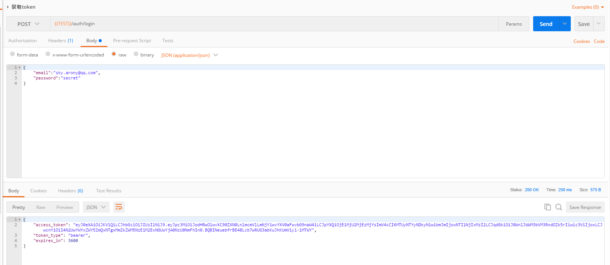
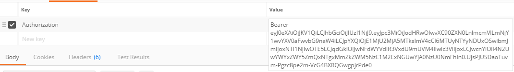
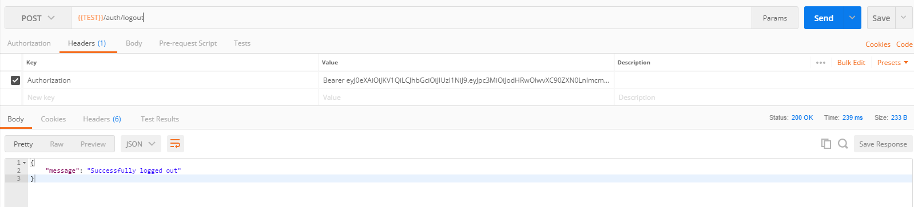
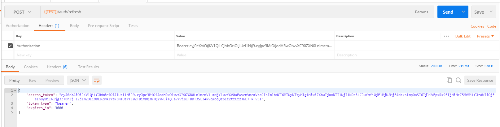

> 2018/5/7
>
> 说实话，官方文档也是相当的乱，这次根据文档并查看源码实验了很多地方，大改了一次。
>
> 本文是以 1.0.0-rc 为基准的。


**JWT** 全称 **JSON Web Tokens** ，是一个非常轻巧的规范。这个规范允许我们使用JWT在用户和服务器之间传递安全可靠的信息。它的两大使用场景是：认证和数据交换。


# 一、安装之前

## 资料

先摆出几个参考资料，可以把连接都打开，方便查阅：

- [项目Wiki](https://github.com/tymondesigns/jwt-auth/wiki/Installation)
- [公众号coding01](https://mp.weixin.qq.com/s/KVUQE2DUetNB2kqxHs0VDg)，[JWT安装及简单例子](https://juejin.im/post/5a0812a16fb9a0451704ad96)
- [官方安装指导文档](http://jwt-auth.readthedocs.io/en/docs/laravel-installation/)
- [JWT的介绍](https://jwt.io/introduction/)


# 二、安装及基础配置

## Laravel

### 1. 使用 composer 安装

```shell
# 建议使用1.0以上版本
composer require tymon/jwt-auth 1.*@rc
```

### 2. 进行一些配置

这里指的注意的是，有些文档会说要添加 `Tymon\JWTAuth\Providers\LaravelServiceProvider::class` ，这只在 Laravel 5.4 及以下版本是必要的，更新的 Laravel 版本无需添加。

还有一些文档说要添加 `Tymon\JWTAuth\Providers\JWTAuthServiceProvider` 这是很久以前的 JWT 版本的（大概0.5.3 以前的版本）。

#### 2.1 发布配置文件

```shell
# 这条命令会在 config 下增加一个 jwt.php 的配置文件
php artisan vendor:publish --provider="Tymon\JWTAuth\Providers\LaravelServiceProvider"
```

#### 2.2 生成加密密钥

```shell
# 这条命令会在 .env 文件下生成一个加密密钥，如：JWT_SECRET=foobar
php artisan jwt:secret
```

#### 2.3 更新你的模型

如果你使用默认的 User 表来生成 token，你需要在该模型下增加一段代码

```php
<?php

namespace App;

use Tymon\JWTAuth\Contracts\JWTSubject;
use Illuminate\Notifications\Notifiable;
use Illuminate\Foundation\Auth\User as Authenticatable;

class User extends Authenticatable implements JWTSubject	# 这里别忘了加
{
    use Notifiable;

    // Rest omitted for brevity

    /**
     * Get the identifier that will be stored in the subject claim of the JWT.
     *
     * @return mixed
     */
    public function getJWTIdentifier()
    {
        return $this->getKey();
    }

    /**
     * Return a key value array, containing any custom claims to be added to the JWT.
     *
     * @return array
     */
    public function getJWTCustomClaims()
    {
        return [];
    }
}
```

#### 2.4 注册两个 Facade

这两个 Facade 并不是必须的，但是使用它们会给你的代码编写带来一点便利。

**config/app.php**

```php
'aliases' => [
		...
		// 添加以下两行
        'JWTAuth' => 'Tymon\JWTAuth\Facades\JWTAuth',
        'JWTFactory' => 'Tymon\JWTAuth\Facades\JWTFactory',
],
```

**如果你不使用这两个 Facade，你可以使用辅助函数 auth()**

auth() 是一个辅助函数，返回一个guard，暂时可以看成 Auth Facade。

对于它有很多有必要说的，可以看我单独写的一篇文章——[Laravel 辅助函数 auth 与 JWT 扩展详解](/2018/05/08/Laravel-辅助函数auth与JWT扩展详解)

```php
// 如果你不用 Facade，你可以这么写
auth('api')->refresh();
// 用 JWTAuth Facade
JWTAuth::parseToken()->refresh();
```

两个 Facede 常用可使用方法，可以看文章后面的附录。

#### 2.5 修改 auth.php

**config/auth.php**

```php
'guards' => [
    'web' => [
        'driver' => 'session',
        'provider' => 'users',
    ],

    'api' => [
        'driver' => 'jwt',		// 原来是 token 改成jwt
        'provider' => 'users',
    ],
],
```

#### 2.6 注册一些路由

注意：在 Laravel 下，`route/api.php` 中的路由默认都有前缀 `api` 。

```php
Route::group([

    'prefix' => 'auth'

], function ($router) {

    Route::post('login', 'AuthController@login');
    Route::post('logout', 'AuthController@logout');
    Route::post('refresh', 'AuthController@refresh');
    Route::post('me', 'AuthController@me');

});
```

#### 2.7 创建 token 控制器

```shell
php artisan make:controller AuthController
```

**AuthController**

值得注意的是 Laravel 这要用 `auth('api')` ，至于为什么，我另一篇关于 JWT 扩展详解的文章里有讲。

```php
<?php

namespace App\Http\Controllers;

use Illuminate\Support\Facades\Auth;
use App\Http\Controllers\Controller;

class AuthController extends Controller
{
    /**
     * Create a new AuthController instance.
     * 要求附带email和password（数据来源users表）
     * 
     * @return void
     */
    public function __construct()
    {
        $this->middleware('auth:api', ['except' => ['login']]);
    }

    /**
     * Get a JWT via given credentials.
     *
     * @return \Illuminate\Http\JsonResponse
     */
    public function login()
    {
        $credentials = request(['email', 'password']);

        if (! $token = auth('api')->attempt($credentials)) {
            return response()->json(['error' => 'Unauthorized'], 401);
        }

        return $this->respondWithToken($token);
    }

    /**
     * Get the authenticated User.
     *
     * @return \Illuminate\Http\JsonResponse
     */
    public function me()
    {
        return response()->json(auth('api')->user());
    }

    /**
     * Log the user out (Invalidate the token).
     *
     * @return \Illuminate\Http\JsonResponse
     */
    public function logout()
    {
        auth('api')->logout();

        return response()->json(['message' => 'Successfully logged out']);
    }

    /**
     * Refresh a token.
     * 刷新token，如果开启黑名单，以前的token便会失效。
     * 值得注意的是用上面的getToken再获取一次Token并不算做刷新，两次获得的Token是并行的，即两个都可用。
     * @return \Illuminate\Http\JsonResponse
     */
    public function refresh()
    {
        return $this->respondWithToken(auth('api')->refresh());
    }

    /**
     * Get the token array structure.
     *
     * @param  string $token
     *
     * @return \Illuminate\Http\JsonResponse
     */
    protected function respondWithToken($token)
    {
        return response()->json([
            'access_token' => $token,
            'token_type' => 'bearer',
            'expires_in' => auth('api')->factory()->getTTL() * 60
        ]);
    }
}
```


## Lumen

### 1. 使用 composer 安装

上面是用命令行安装的，这里用 composer.json 安装。

```json
// 我当时可用的版本是这个
"tymon/jwt-auth": "1.*@rc"
```

执行

```shell
composer update
```

### 2. 进行一些配置

#### 2.1 开启 Facade 和 Eloquent 

取消以下行的注释。

**bootstrap/app.php**

```php
// $app->withFacades();

// $app->withEloquent();
```

#### 2.2 开启中间件认证

取消以下行的注释。

**bootstrap/app.php**

```php
// $app->routeMiddleware([
//     'auth' => App\Http\Middleware\Authenticate::class,
// ]);

// $app->register(App\Providers\AuthServiceProvider::class);
```

#### 2.3 添加服务提供者
**bootstrap/app.php** 

```php
// 有些文档里是说添加 Tymon\JWTAuth\Providers\JWTAuthServiceProvider::class，那是旧版本的
$app->register(\Tymon\JWTAuth\Providers\LumenServiceProvider::class);
```

#### 2.4 生成加密密钥

```shell
# 这条命令会在 .env 文件下生成一个加密密钥，如：JWT_SECRET=foobar
php artisan jwt:secret
```

#### 2.5 更新你的模型

如果你使用默认的 User 表来生成 token，你需要在该模型下增加一段代码

```php
<?php

namespace App;

use Illuminate\Auth\Authenticatable;
use Laravel\Lumen\Auth\Authorizable;
use Illuminate\Database\Eloquent\Model;
use Illuminate\Contracts\Auth\Authenticatable as AuthenticatableContract;
use Illuminate\Contracts\Auth\Access\Authorizable as AuthorizableContract;
use Tymon\JWTAuth\Contracts\JWTSubject;

class User extends Model implements AuthenticatableContract, AuthorizableContract, JWTSubject
{
    use Authenticatable, Authorizable;

    ...
    
    /**
     * Get the identifier that will be stored in the subject claim of the JWT.
     *
     * @return mixed
     */
    public function getJWTIdentifier()
    {
        return $this->getKey();
    }

    /**
     * Return a key value array, containing any custom claims to be added to the JWT.
     *
     * @return array
     */
    public function getJWTCustomClaims()
    {
        return [];
    }
}
```

#### 2.6 注册两个 Facade 

Lumen 中没有辅助函数 auth()，这两个 Facade 就挺有用了。

**bootstrap/app.php**

把原先去了注释的那一行再改一下。

```php
$app->withFacades(true, [
    'Tymon\JWTAuth\Facades\JWTAuth' => 'JWTAuth',
    'Tymon\JWTAuth\Facades\JWTFactory' => 'JWTFactory',
]);
```

#### 2.7 设置 auth.php

把 `\vendor\laravel\lumen-framework\config\auth.php` 也复制到 项目根目录`config` 文件夹（没有就新建）。

> 文档中有提到 `Lumen 风格的配置文件这个概念`
>
> 指的就是都在 .env 文件中设置各种设置项，在 `\vendor\laravel\lumen-framework\config` 文件夹下面的其他配置文件中也可以看到，很多配置项都有 `env(设置项key, 默认值)` 这个方法，有这个配置项的就可以在 .env 文件中设置 `设置项=你的设置值` 这样设置。
>
> 而复制到根目录 `config` 文件夹是 Laravel 风格的配置文件实现方式
>
> 这里我本来想尽量按 Lumen 风格实现的，但是下面这些属性默认并没有 `env()` 方式实现，所以我还是复制到根目录下改算了。

**auth.php**

按下面进行添加或修改。

```php
'guards' => [
    'api' => [
        'driver' => 'jwt',
        'provider' => 'users',
    ],
],

...

'providers' => [
    'users' => [
        'driver' => 'eloquent',
        'model' => \App\User::class
]
```

#### 2.8 注册一些路由

```php
Route::group([

    'prefix' => 'auth'

], function ($router) {

    Route::post('login', 'AuthController@login');
    Route::post('logout', 'AuthController@logout');
    Route::post('refresh', 'AuthController@refresh');
    Route::post('me', 'AuthController@me');

});
```

#### 2.9 创建 token 控制器

Lumen 还精简了很多辅助函数，比如 auth 和 bcrypt 等。

可以安装 [cosmicvelocity/lumen-helpers](https://packagist.org/packages/cosmicvelocity/lumen-helpers) 或 [albertcht/lumen-helpers](https://packagist.org/packages/albertcht/lumen-helpers) 补全（建议用后者，更好安装）

或者使用上面说的两个 Facade。

**AuthController.php** 

如果你没使用扩展补充的辅助函数，你需要这么写，不然直接用上面的 Larvavel 那个

```php
<?php

namespace App\Http\Controllers;

use Illuminate\Http\Request;
use Tymon\JWTAuth\Facades\JWTAuth;

class AuthController extends Controller
{
    /**
     * Create a new AuthController instance.
     *
     * @return void
     */
    public function __construct()
    {
        $this->middleware('auth:api', ['except' => ['login']]);
    }

    /**
     * Get a JWT via given credentials.
     *
     * @return \Illuminate\Http\JsonResponse
     */
    public function login(Request $request)
    {
        $credentials = $request->only('email', 'password');

        if (! $token = JWTAuth::attempt($credentials)) {
            return response()->json(['error' => 'Unauthorized'], 401);
        }

        return $this->respondWithToken($token);
    }

    /**
     * Get the authenticated User.
     *
     * @return \Illuminate\Http\JsonResponse
     */
    public function me()
    {
        return response()->json(JWTAuth::parseToken()->touser());
    }

    /**
     * Log the user out (Invalidate the token).
     *
     * @return \Illuminate\Http\JsonResponse
     */
    public function logout()
    {
        JWTAuth::parseToken()->invalidate();

        return response()->json(['message' => 'Successfully logged out']);
    }

    /**
     * Refresh a token.
     *
     * @return \Illuminate\Http\JsonResponse
     */
    public function refresh()
    {
        return $this->respondWithToken(JWTAuth::parseToken()->refresh());
    }

    /**
     * Get the token array structure.
     *
     * @param  string $token
     *
     * @return \Illuminate\Http\JsonResponse
     */
    protected function respondWithToken($token)
    {
        return response()->json([
            'access_token' => $token,
            'token_type' => 'bearer',
            'expires_in' => JWTAuth::factory()->getTTL() * 60
        ]);
    }
}
```


## 关于中间件

1.0 版本以上的 jwt-auth，中间件在服务提供者中已经定义了，所以不需要额外写，按上面来即可。


# 三、JWT Token 详解

## 1. token 的获取、使用、删除和刷新
- 以下用 postman 演示，`{{TEST}}` 为 postman 全局变量：`test.yfree.ccc`
- Laravel 环境下写在 api.php 中的路由默认有前缀 api
- 下面的图是 Lumen 环境的，没有默认区前缀 api

### 1.1 获取 token 


### 1.2 使用 token

有两种使用方法：

- 加到 url 中：`?token=你的token`
- 加到 header 中，建议用这种，因为在 https 情况下更安全：`Authorization:Bearer 你的token` 



> 添加中间件保护的就需要使用 token进行访问
>
> 可以使用的中间件有 auth、auth:api、jwt.auth、jwt.refresh、jwt.check、jwt.renew
>
> 关于这些中间件之间有什么差别，可以看我的另一篇文章：[Laravel 辅助函数 auth 与 JWT 扩展详解](/2018/05/08/Laravel-辅助函数auth与JWT扩展详解)

### 1.3 删除 token


删除 `token` 后，token就会失效，无法再利用其获取数据。

### 1.4 刷新 token



刷新后，旧 token 将会失效,但是你可以设置一个宽限时间，这个在后面具体说。


## 2. token 的组成、创建以及解析

### 2.1 token 的组成
一个JWT实际上就是一个字符串，它由三部分组成，头部、载荷与签名，中间用 `.` 分隔，例如：`xxxxx.yyyyy.zzzzz`

#### 头部（header）
头部通常由两部分组成：令牌的类型（即JWT）和正在使用的散列算法（如HMAC SHA256 或 RSA.）。
例如：

```json
{
  "alg": "HS256",
  "typ": "JWT"
}
```
然后用 `Base64Url` 编码得到头部，即 `xxxxx`。


#### 载荷（Payload）
载荷中放置了 `token` 的一些基本信息，以帮助接受它的服务器来理解这个 `token`，载荷的属性也分三类：预定义（Registered）、公有（public）和私有（private），接下来主要介绍预定义的。

```json
{
  "sub": "1",
  "iss": "http://localhost:8000/auth/login",
  "iat": 1451888119,
  "exp": 1454516119,
  "nbf": 1451888119,
  "jti": "37c107e4609ddbcc9c096ea5ee76c667"
}
```

这里面的前6个字段都是由JWT的[标准](https://tools.ietf.org/html/draft-ietf-oauth-json-web-token-32)所定义的，也就是预定义（Registered claims）的。

> - sub: 该JWT所面向的用户
> - iss: 该JWT的签发者
> - iat(issued at): 在什么时候签发的token
> - exp(expires): token什么时候过期
> - nbf(not before)：token在此时间之前不能被接收处理
> - jti：JWT ID为web token提供唯一标识

将上面的 `json` 进行 `Base64Url` 编码得到载荷，，即 `yyyyy`。


#### 签名（Signature）
签名时需要用到前面编码过的两个字符串，如果以 `HMACSHA256` 加密，就如下：

```php
HMACSHA256(
    base64UrlEncode(header) + "." +
    base64UrlEncode(payload),
    secret
)
```

加密后再进行 `base64url` 编码最后得到的字符串就是 `token` 的第三部分 `zzzzz`。

组合便可以得到 `token：xxxxx.yyyyy.zzzzz`。

**PHP 代码示例**
```php
// 这里要开启true
$zzzzz = $this->base64url_encode(hash_hmac('sha256', 'xxxxx.yyyyy', getenv('JWT_SECRET'), true));

protected function base64url_encode($data) {
    return rtrim(strtr(base64_encode($data), '+/', '-_'), '=');
}
```

这里插一嘴签名的作用：保证 JWT 没有被篡改过，原理如下：
> HMAC 算法是不可逆算法，类似 MD5 和 hash ，但多一个密钥，密钥（即上面的secret）由客户端和服务端共享，服务端把 token 发给客户端后，客户端可以把其中的头部和载荷再加上事先共享的 secret 再进行一次 HMAC 加密，得到的结果和 token 的第三段进行对比，如果一样则表明数据没有被篡改。


### 2.2 token 的创建

前面的 `AuthController.php` 中有两行展现了这一种 `token` 的创建方法，即用用户所给的账号和密码进行**尝试**，密码正确则用对应的 `User` 信息返回一个 `token` 。

但 `token` 的创建方法不止这一种，接下来介绍 `token` 的三种创建方法：

- 基于账密参数
- 基于 users 模型返回的实例
- 基于 users 模型中的用户主键 id

#### a) 基于账密参数
这就是刚刚说的哪一种，贴出具体代码。

```php
// 使用辅助函数
$credentials = request(['email', 'password']); 
$token = auth()->attempt($credentials)

// 使用 Facade
$credentials = $request->only('email', 'password');
$token = JWTAuth::attempt($credentials);
```

#### b) 基于 users 模型返回的实例
```php
// 使用辅助函数
$user = User::first();
$token = auth()->login($user);

// 使用 Facade
$user = User::first();
$token = JWTAuth::fromUser($credentials);
```

#### c) 基于 users 模型中的主键 id

```php
// 使用辅助函数
$token = auth()->tokenById(1);

// 使用 Facade
源码中没找到
```

### 2.3 token 的解析

#### a) 解析 token 到对象

只有 Facade 需要这样。

```php
// 把请求发送过来的直接解析到对象
JWTAuth::parseToken();
```

#### b) 获取 token 中的 user 信息

```php
// 辅助函数
$user = auth()->user();

// Facade
$user = JWTAuth::parseToken()->authenticate();
```

#### c) 获取 token 

如果 token 被设置则会返回，否则会尝试使用方法从请求中解析 token ，如果token未被设置或不能解析最终返回false。

```php
// 辅助函数
$token = auth()->getToken();

// Facade
$token = JWTAuth::parseToken()->getToken();
```

更多方法可以看文章后面的附录。

#### d) 如果是前端

直接 `base64` 解码 `token` 的前两段即可以知道所需的信息。


## 3. 载荷的设置和获取

#### a) 载荷设置

载荷信息会在 token 解码时得到，同时越大的数组会生成越长的 token ，所以不建议放太多的数据。同时因为载荷是用 `Base64Url` 编码，所以相当于明文，因此绝对不能放密码等敏感信息。

```php
$customClaims = ['foo' => 'bar', 'baz' => 'bob'];

// 辅助函数
$token = auth()->claims($customClaims)->attempt($credentials);

// Facade - 1
$token = JWTAuth::claims($customClaims)->attempt($credentials);

--- 下面两种试了好像不行，不过前面的够用了
   
// Facade - 2
$payload = JWTFactory::make($customClaims);
$token = JWTAuth::encode($payload);

// Facade - 3
$payload = JWTFactory::sub(123)->aud('foo')->foo(['bar' => 'baz'])->make();
$token = JWTAuth::encode($payload);
```

#### b) 载荷解析

从请求中把载荷解析出来。可以去看扩展源代码，里面还有很多的方法。

```php
// 辅助函数
$exp = auth()->payload()->get('exp');
$json = auth()->payload()->toJson();
$array = auth()->payload()->jsonSerialize();
$sub = $array['sub'];

// Facade - 1
$payload = JWTAuth::parseToken()->getPayload();
$payload->get('sub'); // = 123
$payload['jti']; // = 'asfe4fq434asdf'
$payload('exp') // = 123456
$payload->toArray(); // = ['sub' => 123, 'exp' => 123456, 'jti' => 'asfe4fq434asdf'] etc

// Facade - 2
$exp = JWTAuth::parseToken()->getClaim('exp');
```

#### 


## 4. token 的三个时间

一个 `token` 一般来说有三个时间属性，其配置都在 **config/jwt.php** 内。

#### 有效时间
有效时间指的的是你获得 `token` 后，在多少时间内可以凭这个 `token` 去获取内容，逾时无效。

```php
// 单位：分钟
'ttl' => env('JWT_TTL', 60)
```

#### 刷新时间
刷新时间指的是在这个时间内可以凭旧 `token` 换取一个新 `token`。例如 `token` 有效时间为 60 分钟，刷新时间为 20160 分钟，在 60 分钟内可以通过这个 `token` 获取新 `token`，但是超过 60 分钟是不可以的，然后你可以一直循环获取，直到总时间超过 20160 分钟，不能再获取。

```php
// 单位：分钟
'refresh_ttl' => env('JWT_REFRESH_TTL', 20160)
```

#### 宽限时间
宽限时间是为了解决并发请求的问题，假如宽限时间为 0s ，那么在新旧 `token` 交接的时候，并发请求就会出错，所以需要设定一个宽限时间，在宽限时间内，旧 `token` 仍然能够正常使用。

```php
// 宽限时间需要开启黑名单（默认是开启的），黑名单保证过期token不可再用，最好打开
'blacklist_enabled' => env('JWT_BLACKLIST_ENABLED', true)

// 设定宽限时间，单位：秒
'blacklist_grace_period' => env('JWT_BLACKLIST_GRACE_PERIOD', 60)
```


## 5. 关于 JWT 的讨论

### 5.1 为什么用 JWT？

因为 HTTP 是无状态的协议，每一个请求都不会受到前后请求的状态影响，所以就需要 **维护和验证登录状态** 。

**传统方法**

cookies 和 session

**只用cookies**

由于用于验证的敏感信息都保存在本地，即使进行了加密，也并不是特别安全。  

**session**

需要在 `cookies` 中保存 `sessionID` ，然后在服务器中保存 `session` ，其中包括会话ID和用户ID ，同时由于 `session` 常常保存在内存中，所以会对服务器造成比较大的压力。

再加上 `cookies` 的不可跨域名性（子域名之间也算跨域名），跨域操作也存在问题。

**JWT**：
使用 `JWT` 可以做到前后端脱离，解决跨域问题，消除服务器存储session的压力，但是同时增加了计算压力。这两者怎么选择，开发者可以自行考虑。


### 5.2 token 的刷新问题？

**a) token 为什么要刷新吗？**

首先 `Basic Auth` 是一种最简单的认证方法，但是由于每次请求都带用户名和密码，频繁的传输肯定不安全，所以才有 `cookies` 和 `session` 的运用。如果 `token` 不刷新，那么 `token` 就相当于上面的用户名+密码，只要获取到了，就可以一直盗用，因此 `token` 设置有效期并能够进行刷新是必要的。

**b) token 有效期多久合适，刷新频率多久合适？**

有效期越长，风险性越高，有效性越短，刷新频率越高，刷新就会存在刷新开销，所以这需要综合考虑。我个人一般考虑的范围是：15min ~ 120min。

**c) 有没有必要每次都刷新 token ？**

上面考虑的 15min ~ 120min，会存在一个问题，就是**重放攻击**风险，防御这个风险，在 `JWT` 可用的方案是每次请求后都刷新一次 `token` ，但这样又会存在一个新的问题：并发请求。一次并发请求是用的一个 `token` ，第一个完成的请求会导致后面的请求全部失败。可用的解决方案是设置**宽限时间**，即一个 `token` 刷新后，旧 `token` 仍然短暂的可用。可惜这样并不能完美的解决重放攻击，只是增大了不法者攻击的成本。这个问题在 `JWT` 中并没有很好的解决。

下面是可用的中间件，第一二个功能一样，但是第二个不会抛出错误，第三四个功能一样，没什么区别。

**tymon\jwt-auth\src\Providers\AbstractServiceProvider.php**

```php
protected $middlewareAliases = [
    'jwt.auth' => Authenticate::class,
    'jwt.check' => Check::class,
    'jwt.refresh' => RefreshToken::class,
    'jwt.renew' => AuthenticateAndRenew::class,
];
```

### 5.3 token 的刷新总结

因为无法完全解决重放攻击，所以在因重放攻击会导致巨大安全问题和损失的地方，建议使用其他安全认证措施。而日常 `Api` 使用建议如下设置： 

```
有效时间：15min ~ 120min
刷新时间：7天 ~ 30天
宽限时间：60s
```


# 四、附录

## 1. JWT 的 两个 Facade

### 1.1 JWTAuth

`JWTAuth::parseToken()->方法()` 一般都可以换成 `auth()->方法()`。

#### token 生成

**attempt**

根据 user 账密新建一个 token。

```php
$credentials = $request->only('email', 'password');
$token = JWTAuth::attempt($credentials)；
```

**fromUser** or **fromSubject**

根据 user 对象生成一个 token。后者是前者别名。

```php
$user = User::find(1);
$token = JWTAuth::fromUser($user);
```


#### token 控制

**refresh**

更新 token。

```php
$newToken = JWTAuth::parseToken()->refresh();
```

**invalidate**

让一个 token 无效。

```php
JWTAuth::parseToken()->invalidate();
```

**check**

检验 token 的有效性。

```php
if(JWTAuth::parseToken()->check()) {
    dd("token是有效的");
}
```


#### token 解析

**authenticate** or **toUser** or **user**

这三个效果是一样的，`toUser` 是 `authenticate` 的别名，而 `user` 比前两者少一个 user id 的校验，但并没有什么影响。

```php
$user = JWTAuth::parseToken()->toUser();
```

**parseToken**

从 request 中解析 token 到对象中，以便进行下一步操作。

```php
JWTAuth::parseToken();
```

**getToken**

从 request 中获取token。

```php
$token = JWTAuth::getToken();  // 这个不用 parseToken ，因为方法内部会自动执行一次
```


#### 载荷控制

**customClaims** or **claims**

设置载荷的 customClaims 部分。后者是前者的别名。

```php
$customClaims = ['sid' => $sid, 'code' => $code];
$credentials = $request->only('email', 'password');
$token = JWTAuth::customClaims($customClaims)->attempt($credentials);
```

**getCustomClaims**

获取载荷的 customClaims 部分，返回一个数组。

```php
$customClaims = JWTAuth::parseToken()->getCustomClaims()
```

**getPayload** or **payload**

获取所有载荷，三个都是一样的，最后一个一般用来检验 token 的有效性

```php
$payload = JWTAuth::parseToken()->payload();

// then you can access the claims directly e.g.
$payload->get('sub'); // = 123
$payload['jti']; // = 'asfe4fq434asdf'
$payload('exp') // = 123456
$payload->toArray(); // = ['sub' => 123, 'exp' => 123456, 'jti' => 'asfe4fq434asdf'] etc
```

**getClaim**

获取载荷中指定的一个元素。

```php
$sub = JWTAuth::parseToken()->getClaim('sub');
```


### 1.2 JWTGuard

这个 Facade 主要进行载荷的管理，返回一个载荷对象，然后可以通过 JWTAuth 来对其生成一个 token。

```php
// 载荷的高度自定义
$payload = JWTFactory::sub(123)->aud('foo')->foo(['bar' => 'baz'])->make();
$token = JWTAuth::encode($payload);
```

```php
$customClaims = ['foo' => 'bar', 'baz' => 'bob'];
$payload = JWTFactory::make($customClaims);
$token = JWTAuth::encode($payload);
```


### 1.3 其他一些用法

这里用 auth 的写法，因为 Laravel 有多个 guard，默认 guard 也不是 api ，所以需要写成 `auth('api')` 否则，`auth()` 即可。 

#### 设置载荷

```php
$token = auth('api')->claims(['foo' => 'bar'])->attempt($credentials);
```

#### 显示设置 token

```php
$user = auth('api')->setToken('eyJhb...')->user();
```

#### 显示设置请求

```php
$user = auth('api')->setRequest($request)->user();
```

#### 重写有效时间

```php
$token = auth('api')->setTTL(7200)->attempt($credentials);
```

#### 验证账密是否正确

```php
$boolean = auth('api')->validate($credentials);
```


