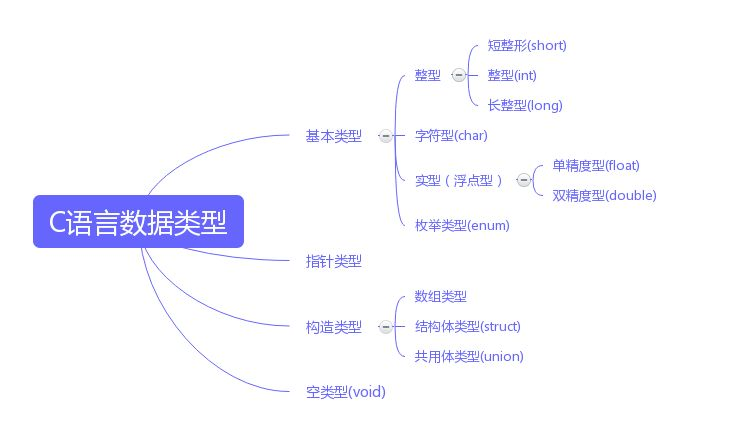

平常除了刷题不常用 C ，为了方便能够快速拾起，整理了此文档，前面的仅是常用的部分，不常的内容会单独列出。

```c
#include <stdio.h>

int main(){
    printf("Hello World!");
}
```


# 一、语法

## 数据类型、运算符

### 1. 数据类型



|        数据类型         |            所占字节数            |     取值范围     |
| :-----------------: | :-------------------------: | :----------: |
|        char         |              1              |              |
|      short int      |              2              | -32768~32767 |
| unsigned short inrt |              2              |   0~65535    |
|         int         |       2/4/4（16/32/64）       | -21亿~21亿（4）  |
|      long int       | 2/4/4/8（16/32/64Win/64Unix） | -21亿~21亿（4）  |
|    long long int    |         8/8（32/64）          | 2^64^ 1844亿亿 |
|        float        |              4              |              |
|       double        |              8              |              |
|     long double     |              8              |              |
|       sizeof        |            计算字节数            |              |
|         指针          |         4/8（32/64）          |              |

> 关于 int 和 long 的位数该怎么记：记为 2/4/8 即可，只有 win 的 long 为 4。

### 2. 运算符

仅记录位运算

|  运算符   |  含义   |     备注     |
| :----: | :---: | :--------: |
| <<  >> | 左移，右移 | 左乘以2,，右除以2 |
|   &    |  按位与  |    全1为1    |
|   ^    | 按位异或  | 相同为0，不同为1  |
|   ｜    |  按位或  |    存1为1    |

### 3. 常量

#### 宏常量

```c
#define PI 3.1415	// 没有数据类型
```

#### const 类型修饰符

```c
const float pi 3.1415	// 有数据类型
```

#### 宏定义 #define 和常量 const 的区别

**类型和安全检查不同**

宏定义是字符替换，没有数据类型的区别，同时这种替换没有类型安全检查，可能产生边际效应等错误；

const常量是常量的声明，有类型区别，需要在编译阶段进行类型检查

**编译器处理不同**

宏定义是一个"编译时"概念，在预处理阶段展开，不能对宏定义进行调试，生命周期结束与编译时期；

const常量是一个"运行时"概念，在程序运行使用，类似于一个只读行数据

**存储方式不同**

宏定义是直接替换，不会分配内存，存储与程序的代码段中；

const常量需要进行内存分配，存储与程序的数据段中

**定义域不同**

```
void f1 ()
{
    #define N 12
    const int n 12;
}
void f2 ()
{
    cout<<N <<endl; //正确，N已经定义过，不受定义域限制
    cout<<n <<endl; //错误，n定义域只在f1函数中
}
```

**定义后能否取消**

宏定义可以通过#undef来使之前的宏定义失效

const常量定义后将在定义域内永久有效

```
void f1()
{
  #define N 12
  const int n = 12;

  #undef N //取消宏定义后，即使在f1函数中，N也无效了
  #define N 21//取消后可以重新定义
}
```

**是否可以做函数参数**

宏定义不能作为参数传递给函数

const常量可以在函数的参数列表中出现

#### 字符常量

|  字符   |       含义        |
| :---: | :-------------: |
| '\n'  |       换行        |
| '\r'  |     回车但不换行      |
| '\0'  | 空字符，通常用做字符串结束标志 |
| '\t'  |      水平制表       |
| '\"'  |       双引号       |
| '\''  |       单引号       |
| '\?'  |       问号        |
| '\\\' |       反斜线       |

> 双引号包起来的是字符串 (String)，单引号包起来的是字符常量 (char)

###数组

```c
int array[5]; 	// 容量为50的整型数组
int array[5] = {0,1,2,3,4}；	// 容量为5的整型数组
int array[] = {0,1,2,3,4}	 // 容量为5的整型数组

char str[6];	    // 容量为5的字符数组，因为'\0'要占一个
char str[6] = "hello";	
char str[] = "hello";

int array[10][20];		// 二维数组
```


## 输入 & 输出

更多格式化输入输出，可以参考[这里](http://c.biancheng.net/cpp/html/3100.html)。

### 1. 输入

####scanf

```c
int a,b;
char c;
scanf("%2d%*2d%2d",a,b);	// 输入“123456”，“12” 会赋给 a，“56” 会赋给 b
```

|  格式转化符  |  用法   |
| :-----: | :---: |
| %d 或 %i | 十进制整数 |
|   %c    |  字符   |
|   %s    |  字符串  |
|   %%    | 百分号%  |

#### gets

```c
char a[10];  
gets(a);
puts(a);
```

#### getchar

```c
char a;
a = getchar();
putchar(a);
```

### 2. 输出

#### printf

```c
char s[]="小明";  
int n = 100;
char c = 'A';

printf("%s得了%3.1d分，评了%c\n", s,n,c);	// 小明得了100.0分，评了A
```

|  格式转换符  |                 用法                  |
| :-----: | :---------------------------------: |
| %d 或 %i |              带符号的十进制整数              |
|   %u    |              无符号的十进制整数              |
|   %c    |                 字符                  |
|   %s    |                 字符串                 |
|   %f    |                 浮点                  |
|   %e    |                科学计数法                |
|   %g    |          自动选取 %f 和 %e 中合适的          |
|   %p    |      printf("%p",&i);  输出地址或指针      |
|   %%    |                百分号%                 |
|  %m.n   | %3.2d 表示 3 位整数，2 位小数，m 超过整数位时在前面补空格 |

#### puts

```c
char a[10];  
gets(a);
puts(a);	// puts(a);
```

#### putchar

```c
char a = 'a';
putchar(a);
```


## 函数

### 1. 函数的声明

```c
// 函数：求和
int sum(int x, int y){
    return x + y;
}

// 函数的声明
int sum(int x, int y);
// 函数声明中，参数名并不是必要的，只有参数类型是必要的，所以也可以用下面的写法
int sum(int, int);	// 但是如果是指针不能这么写
```

> C语言中，函数必须写在 main() 函数前面才能被调用。或者先把函数声明写在前面，然后在 main() 函数后面再补写完整函数。

### 2. 函数的传参

#### 传值调用

把参数复制一份传入，不会影响实际的参数。

```c
// 传数组作为函数参数
int getAverage(int param[10]){}
int getAverage(int param[]){}

int balance[5] = {1,2,3,4,5};
int avg = getAverage(balance) ;

// 传二维数组给函数
double MatrixMultiple(double a[][], double b[][]);	  /* 这会报错 */
double MatrixMultiple(double a[][2], double b[][3]);  /* 这才是正确的 */
```

#### 引用调用

通过指针传递，对其操作相当于对实参本身进行操作。

```c
// 函数1
int sum(int *arr){}

// 函数2：交换 x 和 y 的值
void swap(int *x, int *y){
    *x = *x + *y;
    *y = *x - *y;
    *x = *x - *y;
}

int main() {
	int a = 13;
	int b = 2;
	swap(&a, &b);	// 函数 2 的使用
	printf("%d-%d", *x, *y) ;
	return 0;
}
```


## 指针

### 1. 指针的理解

使用连字号（&）运算符可以访问变量的内存地址。

```c
int  var1;
char var2[10];

printf("var1 变量的地址： %p\n", &var1);  // var1 变量的地址： 0x7fff5cc109d4
printf("var2 变量的地址： %p\n", &var2);  // var2 变量的地址： 0x7fff5cc109de ，不加 & 也可以
```

**指针**是一个变量，其值为另一个变量的地址，即，内存位置的直接地址。

```c
int *p;  // 指针的声明
char *a = "hello"; // 声明一个指向字符串的指针

// 如果这么写，更好理解指针
int a = 3;
int* p = &a;
```

所有指针的值的实际数据类型都是一样的，都是一个代表内存地址的长的十六进制数。

#### 空指针

为没有确切地址的指针，赋一个 NULL 值是良好的习惯。

```c
int  *ptr = NULL;
printf("%p\n", ptr);  // 0
```

### 2. 指针的使用 

使用（*）号可以访问指针变量值所指的变量。==要充分理解，指针变量 ip 只是一个地址，\*ip 才是指向其变量值。==

```c
int  var = 20;   /* 实际变量的声明 */
int  *ip;        /* 指针变量的声明 */

ip = &var;  /* 在指针变量中存储 var 的地址 */

printf("%p\n", &var  );		// 0x7fff5cc109d4
printf("%p\n", ip );	    // 0x7fff5cc109d4

/* 使用指针访问值 */
printf("%d\n", *ip );  // 20
```

指针的自增和自减。

```c
// 利用指针的自增遍历数组
int  var[] = {10, 100, 200};
int  i, *ptr, MAX=3;
ptr = var;						// 数组的形参代表了该数组在内存中的第一个地址
for ( i = 0; i < MAX; i++){
  // handle
  ptr++;
}

// 利用指针的自减遍历数组
int  var[] = {10, 100, 200};
int  i, *ptr, MAX=3;
ptr = &var[MAX-1];
for ( i = 0; i < MAX; i++){
  // handle
  ptr--;
}
```

指针的比较。

```c
// 利用指针的比较遍历数组
int  var[] = {10, 100, 200};
int  i*ptr, MAX=3;
ptr = var;
while (ptr <= &var[MAX-1]){
  // handle
  ptr++;
}
```

利用指针从函数返回数组。

C 语言不允许函数返回一个完整的数组，但是指针可以完成这一操作。

```c
// 返回一个数组
int *getArray(){
	static int a[] = {1,2,3,4};		// 如果是返回函数内部的局部变量到外部最好用上 static
	return a;
}

int main() {
	int *p;
	p = getArray();
	printf("%d-%d-%d-%d",p[0],p[1],p[2],p[3]);
    return 0;
}
```

> 在C语言中，static关键字有三种用途：
>
> 1. 用于全局变量定义时。
>
>    全局变量定义时加上static修饰，表示该变量为静态全局变量。作用域为当前文件。
>
> 2. 用于函数定义或声明。
>
>    任意函数的定义或声明中包含了static修饰，表示该函数为静态函数，只能在本文件中被调用。
>
> 3. 用于局部变量定义。
>
>    局部变量定义时，带有static关键字，表示其为静态局部变量，只被初始化一次，之后每次调用函数时，该变量值为上次函数退出时的值。即，改变量的生存周期被扩展到整个程序运行时间段内。
>
> static 关键字修饰的变量只有一次能被初始化，即时在此调用这个函数，也不会再被初始化。


### 3. 复杂指针

#### 指向数组的指针

```c
double *p;
double balance[10];
p = balance;		// 数组的形参指向数组的第一个元素的地址
double a = *(balance + 4);  // 这样可以访问数组的第五个元素，即 balance[4]

int array[3][4];
int *pa = array;
array[0] == *pa  		// true
array[1] == *pa + 1		// true    
array[0] == &a[0][0]	// true    
array[0]+1 == &a[0][1]	// true    
    
int (*p)[4];    // 定义一个指向一维4元数组的指针
```

#### 指向函数的指针

函数在 C 语言中也会占据一片内存地址，而这内存地址有一个起始地址，称为函数的入口地址，即函数的指针，和数组类似，函数的入口地址是用函数名表示的。

```c
int add(int x, int y);

int main(){
    int a[] = {1,2,2,3};
    int (*pt)(int b[], int n);	  // 声明一个指向函数的指针
    pt = add;					// 让指针指向函数的入口地址
    int total = (*pt)(a, 6)		 // 利用指针来调用函数
    
    return 0;
}
```

#### 由指针组成的数组

```c
int *p[4];	// 定义一个可以存储四个指针元的数组
```

#### 总结

```c
// 指向数组的指针
int (*p)[3];
// 指向函数的指针
 int (*p)(int);
// 由指针组成的数组
int *p[4];
// 指针的指针
int **p;

// 以下两种其实是一样的
int* n；
int *n;
```


## 结构体 & 共用体

### 1. 结构体

结构体的声明，调用，指向结构体的指针。所占用的内存空间是各成员所占的长度之和。

```c
struct Books
{
   char  title[50];
   char  author[50];
   char  subject[100];
   int   book_id;
} book;					// 在定义的同时声明几个这样的变量

void printBook( struct Books book );  // 函数声明

int main(){
    struct Books book1;		// 像平常变量一样声明
    book1.book_id = 6495407; // 使用 . 访问
    printBook(book1);
    
    struct Books *struct_pointer;	// 声明
    struct_pointer = &book1；	   // 赋值
    struct_pointer->title;		    // 通过指针访问的方式
    return 0；
}
```

> 值得注意的是：使用 . 或 -> 运算符时，前者的前缀是结构体变量，而后者要是结构体指针

### 2. 共用体

一种特殊的数据类型，允许您在相同的内存位置存储不同的数据类型。为了节省内存，比如一个共用体，里面定义了老师和学生，但这两者不会同时用到。

```c
// 共用体所占用的内存应足够存储共用体中最大的成员，如下面的例子是20字节。
union Data
{
   int i;
   float f;
   char  str[20];
} data,class[5];	// 同时定义一个结构体数组，可以去掉 5 ，但同时需要赋初始值

// 在下面的例子中，前两个变量的值会被最后的字符串损坏。
int main(){
    union Data data;
   	data.i = 10;
    data.f = 220.5;
   	strcpy( data.str, "C Programming");
    return 0;
}
```


## 常用函数

### 1. 字符串操作

```c
#include <string.h>
```

|       函数名       |                    作用                    |
| :-------------: | :--------------------------------------: |
| strcpy(s1, s2); |            复制字符串 s2 到字符串 s1。             |
| strcat(s1, s2); |          连接字符串 s2 到字符串 s1 的末尾。           |
|   strlen(s1);   |              返回字符串 s1 的长度。               |
| strcmp(s1, s2); | 如果 s1 和 s2 是相同的，则返回 0；<br />如果 s1\<s2 则返回小于 0；<br />如果 s1\>s2 则返回大于 0。 |
| strchr(s1, ch); |    返回一个指针，指向字符串 s1 中字符 ch 的第一次出现的位置。     |
| strstr(s1, s2); |    返回一个指针，指向字符串 s1 中字符串 s2 的第一次出现的位置。    |

### 2. 数学函数

```c
#include <math.h>
```

|       函数名        |           作用           |
| :--------------: | :--------------------: |
|     sqrt(x)      |         计算平方根          |
|     fabs(x)      |          求绝对值          |
| log(x)  log10(x) | 计算 lnx（e）   计算 lgx（10） |
|      exp(x)      |        计算 e^x^         |
|    pow(x ,y)     |        计算 x^y^         |
|     ceil(x)      |          向上取整          |
|     floor(x)     |          向下取整          |
|    fmod(x, y)    |     计算 x 除以 y 的余数      |

## 文件操作


## 内存管理


##  标准库


## *不常用

### 1. 枚举常量

用于定义一些离散的数据。

```c
enum DAY
{
      MON=1, 
      TUE, 
      WED, 
      THU, 
      FRI, 
      SAT, 
      SUN
};	// 枚举常量中，一个常量若没有被赋值，则默认为前面的值加上 1，若全未指定，第一个就为 0
```

### 2. 位域

用来压缩存储，其大致规则为：

1. 如果相邻位域字段的类型相同，且其位宽之和小于类型的sizeof大小，则后面的字段将紧邻前一个字段存储，直到不能容纳为止；
2. 如果相邻位域字段的类型相同，但其位宽之和大于类型的sizeof大小，则后面的字段将从新的存储单元开始，其偏移量为其类型大小的整数倍；
3. 如果相邻的位域字段的类型不同，则各编译器的具体实现有差异，VC6采取不压缩方式，Dev-C++采取压缩方式；
4. 如果位域字段之间穿插着非位域字段，则不进行压缩；
5. 整个结构体的总大小为最宽基本类型成员大小的整数倍。

```c
// 一个位域必须存储在同一个字节中，不能跨两个字节，因此最大为8
struct bs{
    unsigned a:4;
    unsigned  :4;    /* 空域 */
    unsigned b:4;    /* 从下一单元开始存放 */
    unsigned c:4
}

struct  AA
{
   unsigned int b1:5;
   unsigned int b2:5;
   unsigned int b3:5;
   unsigned int b4:5;
   unsigned int b5:5;
   unsigned int b6:5;
   unsigned int b7:5;
}AA;
// 只算5个成员,按第一条规则,共占25位,按第五条规则,即sizeof(AA)=4
// 算7个成员，按第一条规则,共占35位,按第五条规则,即sizeof(AA)=8,
```

### 3. **typedef** 

用来取别名

```c
// 给数据类型取别名
typedef int INTERGE;
INTERGE n = 10;

// 给结构体取别名
typedef struct stu{
    char name[20];
    int age;
    char sex;
} STU;
STU body1,body2;
// 等价于
struct stu body1, body2;
```

与宏定义的区别

```c
#define INTERGE int
unsigned INTERGE n;  //没问题

typedef int INTERGE;
unsigned INTERGE n;  //错误，不能在 INTERGE 前面添加 unsigned
```


# 二、附录

## ASCII表

标准 ASCII 编码共收录了 128 个字符，其中包含了 33 个控制字符（具有某些特殊功能但是无法显示的字符）和 95 个可显示字符。'A'(65) 和 'a'(97) 之差为 32。

| 二进制      | 十进制  | 十六进制 | 字符/缩写                                    | 解释                 |
| -------- | ---- | ---- | ---------------------------------------- | ------------------ |
| 00000000 | 0    | 00   | NUL (NULL)                               | 空字符                |
| 00000001 | 1    | 01   | SOH (Start Of Headling)                  | 标题开始               |
| 00000010 | 2    | 02   | STX (Start Of Text)                      | 正文开始               |
| 00000011 | 3    | 03   | ETX (End Of Text)                        | 正文结束               |
| 00000100 | 4    | 04   | EOT (End Of Transmission)                | 传输结束               |
| 00000101 | 5    | 05   | ENQ (Enquiry)                            | 请求                 |
| 00000110 | 6    | 06   | ACK (Acknowledge)                        | 回应/响应/收到通知         |
| 00000111 | 7    | 07   | BEL (Bell)                               | 响铃                 |
| 00001000 | 8    | 08   | BS (Backspace)                           | 退格                 |
| 00001001 | 9    | 09   | HT (Horizontal Tab)                      | 水平制表符              |
| 00001010 | 10   | 0A   | LF/NL(Line Feed/New Line)                | 换行键                |
| 00001011 | 11   | 0B   | VT (Vertical Tab)                        | 垂直制表符              |
| 00001100 | 12   | 0C   | FF/NP (Form Feed/New Page)               | 换页键                |
| 00001101 | 13   | 0D   | CR (Carriage Return)                     | 回车键                |
| 00001110 | 14   | 0E   | SO (Shift Out)                           | 不用切换               |
| 00001111 | 15   | 0F   | SI (Shift In)                            | 启用切换               |
| 00010000 | 16   | 10   | DLE (Data Link Escape)                   | 数据链路转义             |
| 00010001 | 17   | 11   | DC1/XON(Device Control 1/Transmission On) | 设备控制1/传输开始         |
| 00010010 | 18   | 12   | DC2 (Device Control 2)                   | 设备控制2              |
| 00010011 | 19   | 13   | DC3/XOFF(Device Control 3/Transmission Off) | 设备控制3/传输中断         |
| 00010100 | 20   | 14   | DC4 (Device Control 4)                   | 设备控制4              |
| 00010101 | 21   | 15   | NAK (Negative Acknowledge)               | 无响应/非正常响应/拒绝接收     |
| 00010110 | 22   | 16   | SYN (Synchronous Idle)                   | 同步空闲               |
| 00010111 | 23   | 17   | ETB (End of Transmission Block)          | 传输块结束/块传输终止        |
| 00011000 | 24   | 18   | CAN (Cancel)                             | 取消                 |
| 00011001 | 25   | 19   | EM (End of Medium)                       | 已到介质末端/介质存储已满/介质中断 |
| 00011010 | 26   | 1A   | SUB (Substitute)                         | 替补/替换              |
| 00011011 | 27   | 1B   | ESC (Escape)                             | 逃离/取消              |
| 00011100 | 28   | 1C   | FS (File Separator)                      | 文件分割符              |
| 00011101 | 29   | 1D   | GS (Group Separator)                     | 组分隔符/分组符           |
| 00011110 | 30   | 1E   | RS (Record Separator)                    | 记录分离符              |
| 00011111 | 31   | 1F   | US (Unit Separator)                      | 单元分隔符              |
| 00100000 | 32   | 20   | (Space)                                  | 空格                 |
| 00100001 | 33   | 21   | !                                        |                    |
| 00100010 | 34   | 22   | "                                        |                    |
| 00100011 | 35   | 23   | #                                        |                    |
| 00100100 | 36   | 24   | $                                        |                    |
| 00100101 | 37   | 25   | %                                        |                    |
| 00100110 | 38   | 26   | &                                        |                    |
| 00100111 | 39   | 27   | '                                        |                    |
| 00101000 | 40   | 28   | (                                        |                    |
| 00101001 | 41   | 29   | )                                        |                    |
| 00101010 | 42   | 2A   | *                                        |                    |
| 00101011 | 43   | 2B   | +                                        |                    |
| 00101100 | 44   | 2C   | ,                                        |                    |
| 00101101 | 45   | 2D   | -                                        |                    |
| 00101110 | 46   | 2E   | .                                        |                    |
| 00101111 | 47   | 2F   | /                                        |                    |
| 00110000 | 48   | 30   | 0                                        |                    |
| 00110001 | 49   | 31   | 1                                        |                    |
| 00110010 | 50   | 32   | 2                                        |                    |
| 00110011 | 51   | 33   | 3                                        |                    |
| 00110100 | 52   | 34   | 4                                        |                    |
| 00110101 | 53   | 35   | 5                                        |                    |
| 00110110 | 54   | 36   | 6                                        |                    |
| 00110111 | 55   | 37   | 7                                        |                    |
| 00111000 | 56   | 38   | 8                                        |                    |
| 00111001 | 57   | 39   | 9                                        |                    |
| 00111010 | 58   | 3A   | :                                        |                    |
| 00111011 | 59   | 3B   | ;                                        |                    |
| 00111100 | 60   | 3C   | <                                        |                    |
| 00111101 | 61   | 3D   | =                                        |                    |
| 00111110 | 62   | 3E   | >                                        |                    |
| 00111111 | 63   | 3F   | ?                                        |                    |
| 01000000 | 64   | 40   | @                                        |                    |
| 01000001 | 65   | 41   | A                                        |                    |
| 01000010 | 66   | 42   | B                                        |                    |
| 01000011 | 67   | 43   | C                                        |                    |
| 01000100 | 68   | 44   | D                                        |                    |
| 01000101 | 69   | 45   | E                                        |                    |
| 01000110 | 70   | 46   | F                                        |                    |
| 01000111 | 71   | 47   | G                                        |                    |
| 01001000 | 72   | 48   | H                                        |                    |
| 01001001 | 73   | 49   | I                                        |                    |
| 01001010 | 74   | 4A   | J                                        |                    |
| 01001011 | 75   | 4B   | K                                        |                    |
| 01001100 | 76   | 4C   | L                                        |                    |
| 01001101 | 77   | 4D   | M                                        |                    |
| 01001110 | 78   | 4E   | N                                        |                    |
| 01001111 | 79   | 4F   | O                                        |                    |
| 01010000 | 80   | 50   | P                                        |                    |
| 01010001 | 81   | 51   | Q                                        |                    |
| 01010010 | 82   | 52   | R                                        |                    |
| 01010011 | 83   | 53   | S                                        |                    |
| 01010100 | 84   | 54   | T                                        |                    |
| 01010101 | 85   | 55   | U                                        |                    |
| 01010110 | 86   | 56   | V                                        |                    |
| 01010111 | 87   | 57   | W                                        |                    |
| 01011000 | 88   | 58   | X                                        |                    |
| 01011001 | 89   | 59   | Y                                        |                    |
| 01011010 | 90   | 5A   | Z                                        |                    |
| 01011011 | 91   | 5B   | [                                        |                    |
| 01011100 | 92   | 5C   | \                                        |                    |
| 01011101 | 93   | 5D   | ]                                        |                    |
| 01011110 | 94   | 5E   | ^                                        |                    |
| 01011111 | 95   | 5F   | _                                        |                    |
| 01100000 | 96   | 60   | `                                        |                    |
| 01100001 | 97   | 61   | a                                        |                    |
| 01100010 | 98   | 62   | b                                        |                    |
| 01100011 | 99   | 63   | c                                        |                    |
| 01100100 | 100  | 64   | d                                        |                    |
| 01100101 | 101  | 65   | e                                        |                    |
| 01100110 | 102  | 66   | f                                        |                    |
| 01100111 | 103  | 67   | g                                        |                    |
| 01101000 | 104  | 68   | h                                        |                    |
| 01101001 | 105  | 69   | i                                        |                    |
| 01101010 | 106  | 6A   | j                                        |                    |
| 01101011 | 107  | 6B   | k                                        |                    |
| 01101100 | 108  | 6C   | l                                        |                    |
| 01101101 | 109  | 6D   | m                                        |                    |
| 01101110 | 110  | 6E   | n                                        |                    |
| 01101111 | 111  | 6F   | o                                        |                    |
| 01110000 | 112  | 70   | p                                        |                    |
| 01110001 | 113  | 71   | q                                        |                    |
| 01110010 | 114  | 72   | r                                        |                    |
| 01110011 | 115  | 73   | s                                        |                    |
| 01110100 | 116  | 74   | t                                        |                    |
| 01110101 | 117  | 75   | u                                        |                    |
| 01110110 | 118  | 76   | v                                        |                    |
| 01110111 | 119  | 77   | w                                        |                    |
| 01111000 | 120  | 78   | x                                        |                    |
| 01111001 | 121  | 79   | y                                        |                    |
| 01111010 | 122  | 7A   | z                                        |                    |
| 01111011 | 123  | 7B   | {                                        |                    |
| 01111100 | 124  | 7C   | \|                                       |                    |
| 01111101 | 125  | 7D   | }                                        |                    |
| 01111110 | 126  | 7E   | ~                                        |                    |
| 01111111 | 127  | 7F   | DEL (Delete)                             | 删除                 |

上表是标准的 ASCII 编码，它共收录了 128 个字符，用一个字节中较低的 7 个比特位（Bit）足以表示（2^7^ = 128），所以还会空闲下一个比特位，它就被浪费了。

> 来源：http://c.biancheng.net/cpp/html/3451.html


